# AI Agents: From Zero to Your First Working Agent (100% Free)

This is a complete guide in simple English. It starts with **what an AI agent is** and ends with **an agent you built and ran yourself**, and then goes on to the more advanced ideas.

- No AI knowledge needed. We explain every word the first time we use it.
- No paid API or credit card. Everything uses **free** models.
- If you can run a Python script, you can finish this guide.

Read it from top to bottom. By the end you will not need any other tutorial to understand the basics of AI agents.

---

## How This Guide Is Organized

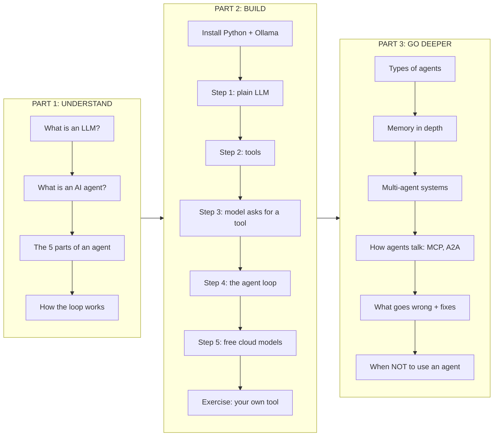

## Table of Contents

**Part 1: Understand AI Agents**

1. [Start Here: What Is an LLM?](#1-start-here-what-is-an-llm)
2. [LLM vs Chatbot vs AI Agent](#2-llm-vs-chatbot-vs-ai-agent)
3. [A Real-Life Example](#3-a-real-life-example)
4. [The 5 Parts of Every AI Agent](#4-the-5-parts-of-every-ai-agent)
5. [The Agent Loop: Think, Act, Observe](#5-the-agent-loop-think-act-observe)
6. [Tool Calling: The Most Important Idea](#6-tool-calling-the-most-important-idea)

**Part 2: Build Your Agent**

7. [What You Will Build](#7-what-you-will-build)
8. [Prerequisites](#8-prerequisites)
9. [Install Python](#9-install-python)
10. [Install Ollama and Download a Model](#10-install-ollama-and-download-a-model)
11. [Create the Project](#11-create-the-project)
12. [Step 0: config.py (Choose Your Model)](#12-step-0-configpy-choose-your-model)
13. [Step 1: Talk to the LLM (Not an Agent Yet)](#13-step-1-talk-to-the-llm-not-an-agent-yet)
14. [Step 2: Give the Model Tools](#14-step-2-give-the-model-tools)
15. [Step 3: Let the Model Ask for a Tool](#15-step-3-let-the-model-ask-for-a-tool)
16. [Step 4: The Agent Loop (Your First AI Agent)](#16-step-4-the-agent-loop-your-first-ai-agent)
17. [Step 5: Switch to a Free Cloud Model](#17-step-5-switch-to-a-free-cloud-model)
18. [Exercise: Add Your Own Tool](#18-exercise-add-your-own-tool)

**Part 3: Go Deeper**

19. [Memory: Short-Term and Long-Term](#19-memory-short-term-and-long-term)
20. [Types of AI Agents](#20-types-of-ai-agents)
21. [Multi-Agent Systems](#21-multi-agent-systems)
22. [How Agents Talk to Each Other](#22-how-agents-talk-to-each-other)
23. [MCP and A2A: The Standard Protocols](#23-mcp-and-a2a-the-standard-protocols)
24. [What Goes Wrong (and How to Fix It)](#24-what-goes-wrong-and-how-to-fix-it)
25. [When to Use an Agent (and When Not To)](#25-when-to-use-an-agent-and-when-not-to)
26. [Real AI Agents You Already Know](#26-real-ai-agents-you-already-know)
27. [Troubleshooting](#27-troubleshooting)
28. [Glossary](#28-glossary)
29. [What Next?](#29-what-next)

---
---

# PART 1: UNDERSTAND AI AGENTS

---

## 1. Start Here: What Is an LLM?

**LLM** means **Large Language Model**. ChatGPT, Gemini, Claude, Llama and Qwen are all built on LLMs.

An LLM does **one** thing: it reads some text and writes the text that should come next.

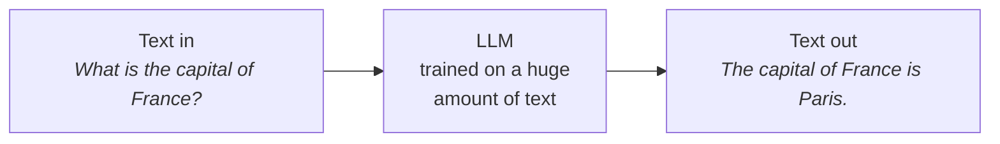

An LLM is very smart, but on its own it has **three big limits**:

| Limit | What it means | Example |
|---|---|---|
| **Frozen knowledge** | It only knows what it learned during training | It does not know today's weather or today's news |
| **Cannot act** | It can only write text. It cannot click, save, send or search | It cannot save a note or book a ticket for you |
| **One shot** | It answers once and stops. It does not check its own work or try again | For a 5-step task, it guesses everything in one go |

An **AI agent** removes all three limits.

---

## 2. LLM vs Chatbot vs AI Agent

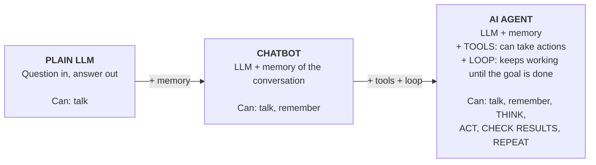

The difference in one line:

> A chatbot **tells you** how to do something. An agent **does it for you**.

| You ask... | Plain LLM / Chatbot | AI Agent |
|---|---|---|
| "What is the weather in Delhi?" | "I can't access live data." | Calls a weather API, then: "It is 33°C in Delhi." |
| "Save this as a note." | "Here is how you can save a note..." | Actually writes the note to a file. |
| "Compare the temperature of Delhi and Mumbai." | Guesses numbers | Gets both temperatures, calculates the difference, answers. |

**Definition to remember:**

> An **AI agent** is a program where an **LLM** gets a **goal**, **decides the steps** on its own, uses **tools** to act, and keeps working in a **loop** until the goal is done.

---

## 3. A Real-Life Example

Think of an AI agent as a **smart personal assistant** sitting at a desk.

You say: *"Book me the cheapest flight to Mumbai for Friday."*

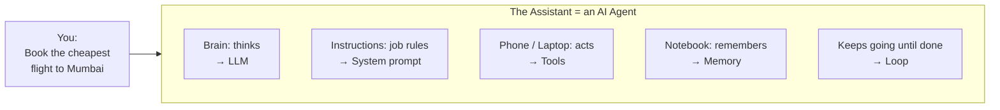

What the assistant does:

```text
  1. THINK   "I need flight options for Friday."
  2. ACT     Opens the airline website and searches        (tool: search_flights)
  3. OBSERVE Sees 5 flights. Cheapest is Rs 4,200.
  4. THINK   "I should check the user's calendar first."
  5. ACT     Checks your calendar                          (tool: read_calendar)
  6. OBSERVE You have a meeting until 2 PM.
  7. THINK   "The cheapest flight after 2 PM is Rs 4,800."
  8. ACT     Books that flight                             (tool: book_flight)
  9. DONE    "Booked the 4:30 PM flight for Rs 4,800. You have a meeting until 2."
```

Nobody gave the assistant a fixed script. It **decided** each next step based on what it **saw** in the previous step. That is exactly how an AI agent works.

---

## 4. The 5 Parts of Every AI Agent

Every AI agent, from a small script to Claude Code or Cursor, is built from the same five parts.

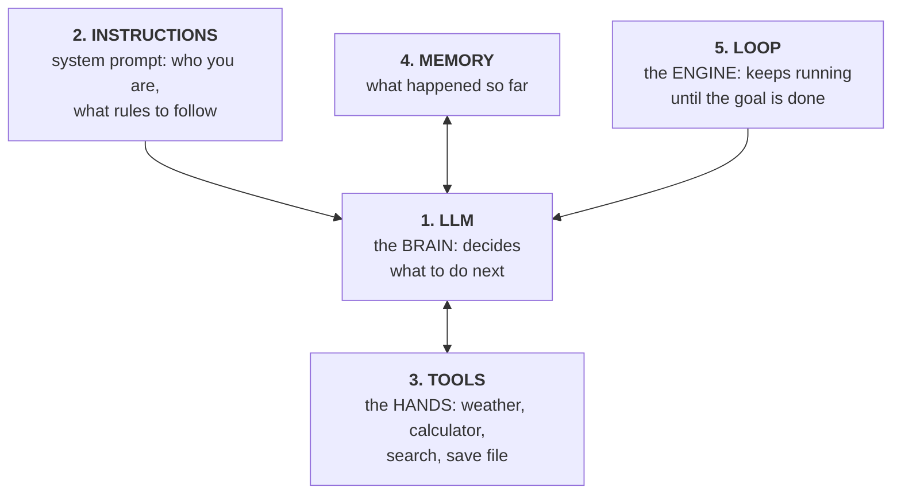

| # | Part | Simple meaning | In our project |
|---|---|---|---|
| 1 | **LLM** | The brain. Reads everything and decides the next step: use a tool, or give the final answer. | `qwen2.5:7b` in Ollama (or Gemini / Groq) |
| 2 | **Instructions** | The job description. Tells the agent who it is and what rules to follow. | `SYSTEM_PROMPT` in `step3_agent.py` |
| 3 | **Tools** | The hands. Normal functions that fetch data or do actions. | `tools.py`: `get_weather`, `calculator`, `get_time`, `save_note` |
| 4 | **Memory** | The notebook. Everything that happened so far, so the agent does not repeat itself. | The `history` list |
| 5 | **Loop** | The engine. Calls the LLM, runs tools, sends results back, repeats. | `run_agent()` in `step3_agent.py` |

---

## 5. The Agent Loop: Think, Act, Observe

This loop is the heart of every agent.

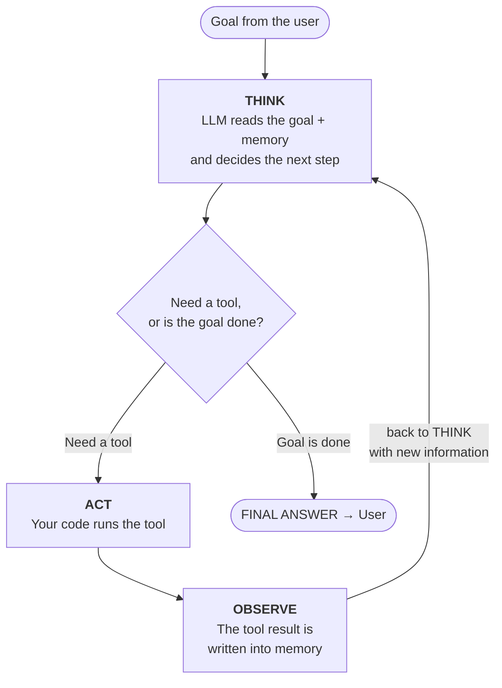

Step by step:

1. The user gives a **goal**.
2. The loop sends the goal + instructions + memory + tool list to the **LLM**.
3. The LLM **thinks** and replies with **either** "call this tool" **or** "here is the final answer".
4. If it asked for a tool, **your code runs the tool** (the LLM cannot run code).
5. The tool result (the **observation**) is added to memory.
6. Go back to step 2. The LLM now knows more and decides again.
7. When the LLM gives a final answer, the loop stops.

> **Safety rule:** always put a **maximum number of steps** on the loop. A confused model can otherwise loop forever. Our code uses `MAX_STEPS = 6`.

---

## 6. Tool Calling: The Most Important Idea

Most beginners get this wrong, so read it twice:

> **The LLM never runs a tool.** It only writes a small, structured message that says *"please call `get_weather` with `city = Delhi`"*. **Your code** runs the real function and gives the result back.

How does the LLM know which tools exist? You send it a **description** of each tool (name, what it does, what inputs it needs). The LLM reads only this description. It never sees your Python code.

Here is the full conversation for one question, shown as a **sequence diagram** (read top to bottom):

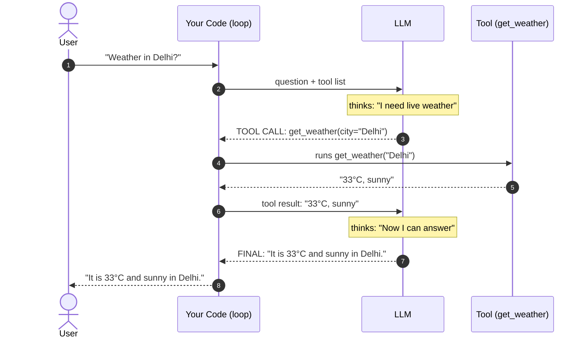

**What a tool call looks like** (this is what the LLM actually sends back):

```json
{
  "role": "assistant",
  "content": null,
  "tool_calls": [
    {
      "id": "call_1",
      "type": "function",
      "function": { "name": "get_weather", "arguments": "{\"city\": \"Delhi\"}" }
    }
  ]
}
```

**What a tool description looks like** (this is what we send to the LLM):

```json
{
  "type": "function",
  "function": {
    "name": "get_weather",
    "description": "Gets the current (live) weather of a city",
    "parameters": {
      "type": "object",
      "properties": { "city": { "type": "string" } },
      "required": ["city"]
    }
  }
}
```

The format for describing inputs is called **JSON Schema**. It is just a standard way to say "this tool needs a text field named `city`".

You now understand the theory. Let's build one.

---
---

# PART 2: BUILD YOUR AGENT

---

## 7. What You Will Build

A terminal chat agent that works like this:

```text
You: What is the temperature difference between Delhi and Mumbai?
   [Step 1] Tool: get_weather({'city': 'Delhi'})
   [Step 1] Result: Delhi: 33.1°C, humidity 52%, wind 9.4 km/h
   [Step 1] Tool: get_weather({'city': 'Mumbai'})
   [Step 1] Result: Mumbai: 28.4°C, humidity 81%, wind 14.2 km/h
   [Step 2] Tool: calculator({'expression': '33.1 - 28.4'})
   [Step 2] Result: 4.7
Agent: Delhi is about 4.7°C warmer than Mumbai right now.
```

Nobody told the agent which tools to use or in what order. It **decided** to fetch the weather twice, then use the calculator, then answer.

### How the project fits together

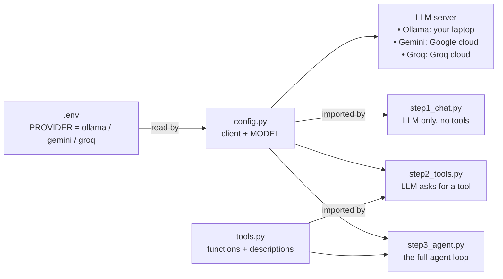

### Final folder structure

```text
AgentDemo/
├── .env              # your settings (provider, API keys) - never share this
├── .env.example      # template for .env
├── .gitignore        # keeps .env and venv out of Git
├── requirements.txt  # Python packages
├── config.py         # picks the model (Ollama / Gemini / Groq)
├── tools.py          # the agent's tools (plain Python functions)
├── step1_chat.py     # plain LLM call
├── step2_tools.py    # model asks for a tool
└── step3_agent.py    # the full AI agent
```

### Every file explained: what it is and why we need it

Before writing any code, here is **every file and folder** in the project in plain words. Think of the project as a **restaurant kitchen**:

```text
 ┌──────────────────────────── THE KITCHEN (AgentDemo/) ────────────────────────────┐
 │                                                                                  │
 │  requirements.txt  = shopping list (which ingredients/packages to buy)           │
 │  venv/             = the pantry where the bought ingredients are kept            │
 │  .env              = the locker with secret keys (only for you)                  │
 │  .env.example      = an empty locker label, showing what goes inside             │
 │  .gitignore        = "do not take these out of the kitchen" list                 │
 │  config.py         = choosing which CHEF (model) is working today                │
 │  tools.py          = the kitchen equipment (knife, oven, weighing scale)         │
 │  step1_chat.py     = chef with NO equipment: can only talk about food            │
 │  step2_tools.py    = chef ASKS for the oven, but does not finish the dish        │
 │  step3_agent.py    = chef uses equipment again and again until the dish is ready │
 │                                                                                  │
 └──────────────────────────────────────────────────────────────────────────────────┘
```

| File / folder | What it is | Why we need it | Who creates it |
|---|---|---|---|
| `requirements.txt` | A plain text list of Python packages | So anyone can install the exact same packages with one command | You |
| `venv/` | A folder with a private copy of Python + packages | Keeps this project's packages separate from other projects | `python3 -m venv venv` |
| `.env` | Your personal settings: provider name, API keys | Secrets should never be written inside code | You (copy of `.env.example`) |
| `.env.example` | The same as `.env` but with empty keys | Shows others which settings exist, without leaking your keys | You |
| `.gitignore` | A list of files Git must ignore | Stops `.env` (keys) and `venv/` (huge) from being uploaded to GitHub | You |
| `config.py` | Python code that connects to the chosen LLM | One place to switch between Ollama, Gemini and Groq | You |
| `tools.py` | The functions the agent can use, plus their descriptions | Tools are the "hands" of the agent | You |
| `step1_chat.py` | Sends one question to the LLM, no tools | Shows the **limits** of a plain LLM | You |
| `step2_tools.py` | Sends a question **with** tools, runs the tool once | Shows that the LLM only **asks** for a tool; your code runs it | You |
| `step3_agent.py` | The full agent: loop + memory + tools | This is the **actual AI agent** | You |
| `__pycache__/` | Auto-generated, compiled copies of your `.py` files | Python makes it to start faster next time. Ignore it. | Python (automatic) |
| `notes.txt` | Notes saved by the `save_note` tool | Proof that the agent actually **did** something | The agent (at runtime) |

**Why split the code into several files instead of one big file?**

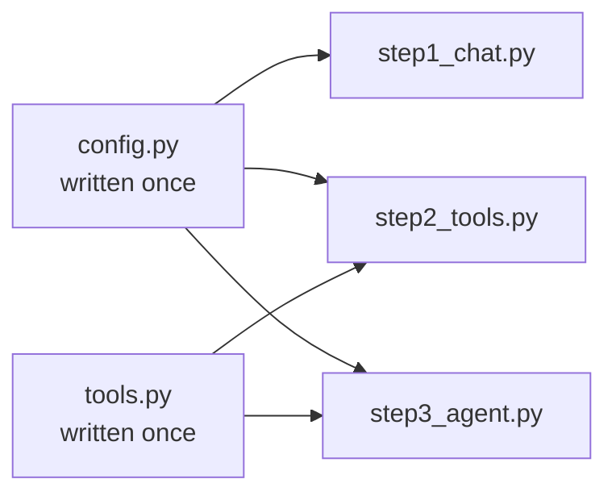

- `config.py` is written **once** and reused by all three steps. Change the model in one place, and every step uses the new one.
- `tools.py` is written **once** and reused by step 2 and step 3. Add a new tool in one place, and the agent can use it.
- The three step files let you **learn one idea at a time**: plain LLM → tool request → full agent.

---

## 8. Prerequisites

| Requirement | Minimum | Recommended |
|---|---|---|
| OS | macOS, Windows 10/11, or Linux | macOS with Apple Silicon (M1-M4) |
| RAM | 8 GB | 16 GB or more |
| Free disk space | 6 GB | 10 GB |
| Python | 3.9 | 3.10 or newer |
| Internet | Needed for downloads and live weather | |

Basic comfort with the terminal (running commands, changing folders) is enough.

> **Low-RAM laptop?** Skip the local model and use a free cloud model instead. See [Step 5](#17-step-5-switch-to-a-free-cloud-model).

---

## 9. Install Python

Check whether Python is already installed:

```bash
# macOS / Linux
python3 --version

# Windows
python --version
```

If you see `Python 3.9` or higher, you are ready. Otherwise install it:

- **macOS:** download from [python.org/downloads](https://www.python.org/downloads/), or run `brew install python`
- **Windows:** download from [python.org/downloads](https://www.python.org/downloads/). **Tick "Add Python to PATH"** on the first screen of the installer.
- **Linux (Ubuntu/Debian):** `sudo apt install python3 python3-venv python3-pip`

> **Windows note:** wherever this guide says `python3`, type `python` instead.

---

## 10. Install Ollama and Download a Model

[Ollama](https://ollama.com) lets you run open-source LLMs **on your own laptop**. It is free, needs no API key and works offline once a model is downloaded.

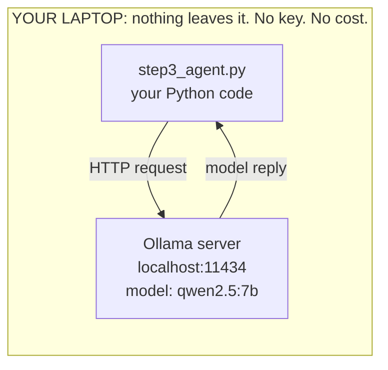

### 10.1 Install Ollama

| OS | How to install |
|---|---|
| **macOS** | Go to [ollama.com/download](https://ollama.com/download), click **Download for macOS**, open the file and drag **Ollama** into **Applications**. Open the app once; a llama icon appears in the menu bar. |
| **Windows** | Go to [ollama.com/download](https://ollama.com/download), download the Windows installer and run it. |
| **Linux** | `curl -fsSL https://ollama.com/install.sh \| sh` |

Verify the install:

```bash
ollama --version
```

> **Heads-up:** if you type just `ollama` with nothing after it, newer versions open a menu offering to launch Claude Code, OpenCode and other integrations. **You do not need any of these.** Press `Esc` to exit. Always type a full command like `ollama pull ...` or `ollama run ...`.

### 10.2 Download a model

Not every model can use tools. We need one that supports **tool calling** (also called function calling). `qwen2.5` is a reliable choice.

Pick the size that matches your laptop:

| Your RAM | Command | Download size | Notes |
|---|---|---|---|
| 8 GB | `ollama pull qwen2.5:3b` | ~1.9 GB | Faster, sometimes makes tool mistakes |
| 16 GB+ | `ollama pull qwen2.5:7b` | ~4.7 GB | **Recommended for this guide** |
| 24 GB+ | `ollama pull qwen2.5:14b` | ~9 GB | Most accurate, a bit slower |

> The number (3b, 7b, 14b) is the number of **parameters** in billions. More parameters usually means smarter but slower and bigger.

```bash
ollama pull qwen2.5:7b
```

Expected output:

```text
pulling manifest
pulling 2bada8a74506: 100% ▕██████████████████▏ 4.7 GB
verifying sha256 digest
writing manifest
success
```

### 10.3 Test the model

```bash
ollama list
```

```text
NAME          ID              SIZE      MODIFIED
qwen2.5:7b    845dbda0ea48    4.7 GB    2 minutes ago
```

Chat with it once:

```bash
ollama run qwen2.5:7b "Hello, introduce yourself in one line"
```

If you get a reply, the model works. (If you started an interactive chat, type `/bye` to exit.)

> On macOS and Windows the Ollama server starts automatically when the Ollama app is open. On Linux, run `ollama serve` in a separate terminal if it is not already running.

---

## 11. Create the Project

### 11.1 Create a folder

```bash
mkdir AgentDemo
cd AgentDemo
```

| Command | Meaning |
|---|---|
| `mkdir AgentDemo` | **m**a**k**e **dir**ectory: creates a new empty folder named `AgentDemo` |
| `cd AgentDemo` | **c**hange **d**irectory: moves your terminal inside that folder. Every file you create next goes here. |

### 11.2 Create a virtual environment

A **virtual environment** (venv) is a private box of Python packages just for this project, so it does not mess with anything else on your computer.

**Why do we need it?** Imagine project A needs version 1 of a package and project B needs version 2. If both install into the same global Python, one of them breaks. A venv gives each project its own separate box.

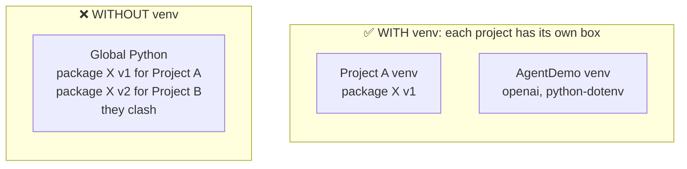

```bash
python3 -m venv venv
```

| Part | Meaning |
|---|---|
| `python3` | Run Python |
| `-m venv` | Use Python's built-in **m**odule called `venv` |
| `venv` (last word) | The name of the folder to create. You could call it anything, but `venv` is the common name. |

After this, a new folder `venv/` appears. It contains a private copy of Python and `pip`. You never edit anything inside it.

Activate it:

```bash
# macOS / Linux
source venv/bin/activate

# Windows (Command Prompt)
venv\Scripts\activate

# Windows (PowerShell)
venv\Scripts\Activate.ps1
```

Your prompt should now start with `(venv)`. Inside the venv, `python` and `pip` work the same on every OS.

**What does "activate" mean?** It tells your terminal: *"from now on, when I type `python` or `pip`, use the copy inside `venv/`, not the global one."* The `(venv)` at the start of the prompt is the sign that it is active.

```text
 (venv) user@laptop AgentDemo %  ◄── "(venv)" means the private box is ON
```

> Every time you open a **new terminal** for this project, `cd` into the folder and activate the venv again. To turn it off, type `deactivate`.

### 11.3 Install packages

**What is `requirements.txt`?** It is a **shopping list** of Python packages the project needs, one package per line. Instead of telling everyone "please install this, then this, then this", you give them one file.

Create a file named **`requirements.txt`** with these two lines:

```text
openai
python-dotenv
```

| Package | What it is | Why we need it |
|---|---|---|
| `openai` | A Python library for talking to chat LLM servers | Ollama, Gemini and Groq all understand the same "OpenAI-compatible" request format, so this **one** library can talk to all three. **We are not using OpenAI's paid service**, only its free library. |
| `python-dotenv` | A small library that reads a `.env` file | Loads our settings (provider name, API keys) from `.env` into Python |

Now install them:

```bash
pip install -r requirements.txt
```

**What does this command do?**

| Part | Meaning |
|---|---|
| `pip` | Python's package installer (like an app store for Python libraries) |
| `install` | Download and install packages |
| `-r requirements.txt` | "**r**ead the list of packages from this file" |

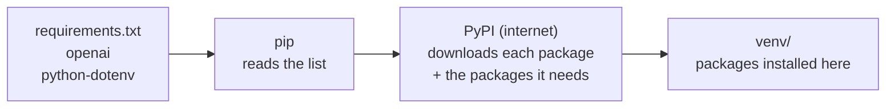

You will see many lines like `Collecting openai...` and `Successfully installed ...`. That is normal: `openai` also needs a few helper packages (like `httpx` and `pydantic`), and `pip` installs them automatically.

Check it worked:

```bash
pip list
```

You should see `openai` and `python-dotenv` in the list.

### 11.4 Create the settings file

**Why a separate settings file?** API keys are like passwords. If you write them inside `config.py` and share your code or push it to GitHub, anyone can steal and misuse them. So we keep **settings and secrets in a separate file** (`.env`) and the **code** only reads from it.

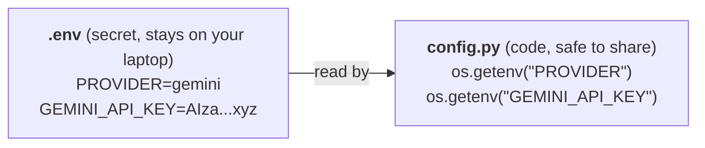

We create **two** files:

| File | Contains | Share it? |
|---|---|---|
| `.env.example` | All setting **names**, with keys left **empty** | Yes. It is a template for others. |
| `.env` | The **same** settings with **your real keys** | **Never** |

Create **`.env.example`**:

```bash
# Copy this file and name the copy .env, then fill in the values
# PROVIDER options: ollama | gemini | groq   (all three are free)
PROVIDER=ollama

# Option 1: Ollama (local, no key needed)
OLLAMA_MODEL=qwen2.5:7b

# Option 2: Gemini free key -> https://aistudio.google.com/apikey
GEMINI_API_KEY=
GEMINI_MODEL=gemini-2.5-flash

# Option 3: Groq free key -> https://console.groq.com/keys
GROQ_API_KEY=
GROQ_MODEL=openai/gpt-oss-20b
```

**Line by line:**

| Line | Meaning |
|---|---|
| `# ...` | Lines starting with `#` are comments. They are notes for humans and are ignored. |
| `PROVIDER=ollama` | Which LLM to use. Change to `gemini` or `groq` later. |
| `OLLAMA_MODEL=qwen2.5:7b` | Which local model to use. Must match a name from `ollama list`. |
| `GEMINI_API_KEY=` | Empty for now. You paste your free Gemini key here in Step 5. |
| `GEMINI_MODEL=gemini-2.5-flash` | Which Gemini model to use |
| `GROQ_API_KEY=` | Empty for now. You paste your free Groq key here in Step 5. |
| `GROQ_MODEL=openai/gpt-oss-20b` | Which Groq model to use |

The format is always `NAME=value`, with **no spaces** around `=` and **no quotes** needed.

Make your real settings file by copying the template:

```bash
# macOS / Linux
cp .env.example .env

# Windows
copy .env.example .env
```

`cp` means **c**o**p**y: it makes a new file `.env` with the same content as `.env.example`. For the local model you do not need to change anything, because `PROVIDER=ollama` is already set.

> **Using the 3b or 14b model?** Change `OLLAMA_MODEL` in `.env` to the model you pulled.
>
> **Can't see `.env` in Finder or File Explorer?** Files starting with a dot are hidden by default. On macOS press `Cmd + Shift + .` in Finder to show them, or open the folder in VS Code.

### 11.5 Create .gitignore

**What is it?** If you put this project on GitHub, Git would upload **every** file. `.gitignore` is a list of files and folders Git should **skip**.

Create **`.gitignore`**:

```text
venv/
.env
__pycache__/
notes.txt
```

| Line | Why we skip it |
|---|---|
| `venv/` | Very large, and anyone can recreate it with `pip install -r requirements.txt` |
| `.env` | Contains your secret API keys |
| `__pycache__/` | Auto-generated by Python, not needed |
| `notes.txt` | Personal notes created by the agent while it runs |

If you never use Git, this file does no harm. It is a good habit.

---

## 12. Step 0: config.py (Choose Your Model)

This file creates **one client object** that the rest of the project uses.

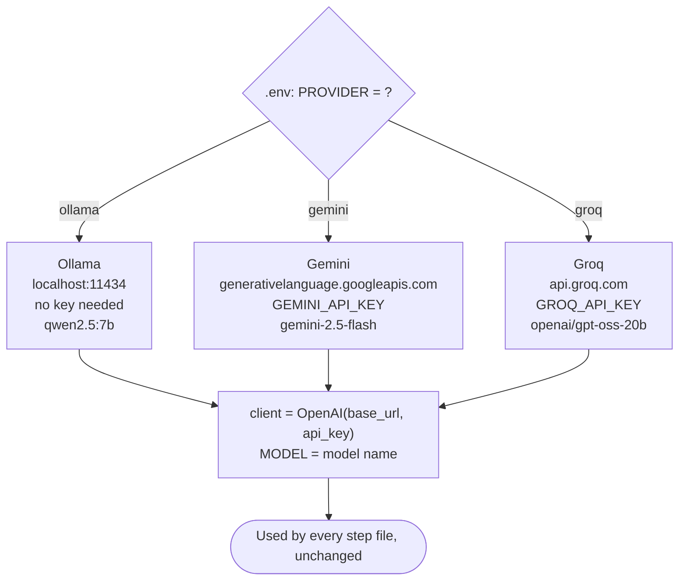

Switching provider only changes three values: the server address (`base_url`), the key (`api_key`) and the model name. The agent code never changes.

Create **`config.py`**:

```python
"""
config.py - Decides which LLM (model) the project uses.

All three options are FREE:
  1. ollama -> A local model running on your laptop (no internet or API key needed)
  2. gemini -> Google AI Studio free API key (aistudio.google.com)
  3. groq   -> Groq free API key (console.groq.com), very fast

All three offer an "OpenAI-compatible" API, so the code stays the same.
Only the base_url, api_key and model name change.
"""
import os
from openai import OpenAI

try:
    from dotenv import load_dotenv
    load_dotenv()          # Load settings from the .env file
except ImportError:
    pass

PROVIDER = os.getenv("PROVIDER", "ollama").lower()

PROVIDERS = {
    "ollama": {
        "base_url": "http://localhost:11434/v1",
        "api_key": "ollama",                                   # dummy value, Ollama does not need a key
        "model": os.getenv("OLLAMA_MODEL", "qwen2.5:7b"),
    },
    "gemini": {
        "base_url": "https://generativelanguage.googleapis.com/v1beta/openai/",
        "api_key": os.getenv("GEMINI_API_KEY"),
        "model": os.getenv("GEMINI_MODEL", "gemini-2.5-flash"),
    },
    "groq": {
        "base_url": "https://api.groq.com/openai/v1",
        "api_key": os.getenv("GROQ_API_KEY"),
        "model": os.getenv("GROQ_MODEL", "openai/gpt-oss-20b"),
    },
}

if PROVIDER not in PROVIDERS:
    raise SystemExit(f"Invalid PROVIDER '{PROVIDER}'. Use one of: ollama | gemini | groq")

_cfg = PROVIDERS[PROVIDER]
if not _cfg["api_key"]:
    raise SystemExit(f"{PROVIDER.upper()}_API_KEY is missing. Add it to your .env file.")

client = OpenAI(base_url=_cfg["base_url"], api_key=_cfg["api_key"])
MODEL = _cfg["model"]

print(f"[Config] Provider: {PROVIDER} | Model: {MODEL}")
```

### Code walkthrough: config.py

**Why this file exists:** every step file needs to talk to an LLM. Instead of writing the connection code three times, we write it **once** here. The other files simply say `from config import client, MODEL`.

**Part 1: Imports**

```python
import os
from openai import OpenAI
```

- `os` is a built-in Python module. We use `os.getenv(...)` to read settings.
- `OpenAI` is the client class from the `openai` package. A **client** is an object that knows how to send requests to an LLM server and read the replies.

**Part 2: Load the `.env` file**

```python
try:
    from dotenv import load_dotenv
    load_dotenv()
except ImportError:
    pass
```

- `load_dotenv()` opens `.env` and makes every `NAME=value` line available to `os.getenv("NAME")`.
- `try / except ImportError` means: if `python-dotenv` is not installed, do not crash; just continue.

**Part 3: Read which provider to use**

```python
PROVIDER = os.getenv("PROVIDER", "ollama").lower()
```

- Reads `PROVIDER` from `.env`. If it is missing, the default is `"ollama"`.
- `.lower()` turns `Gemini` or `GEMINI` into `gemini`, so capital letters do not cause errors.

**Part 4: The provider table**

```python
PROVIDERS = {
    "ollama": { "base_url": ..., "api_key": ..., "model": ... },
    "gemini": { ... },
    "groq":   { ... },
}
```

This is a Python **dictionary**, a lookup table. For each provider it stores three things:

| Key | Meaning | Ollama example |
|---|---|---|
| `base_url` | The address of the LLM server | `http://localhost:11434/v1` (your own laptop) |
| `api_key` | The password for that server | `"ollama"` (a dummy value; Ollama does not check it) |
| `model` | Which model on that server to use | `qwen2.5:7b` |

Notice `os.getenv("OLLAMA_MODEL", "qwen2.5:7b")`: read from `.env`, and if missing, use the default after the comma.

**Part 5: Safety checks**

```python
if PROVIDER not in PROVIDERS:
    raise SystemExit(...)

_cfg = PROVIDERS[PROVIDER]
if not _cfg["api_key"]:
    raise SystemExit(...)
```

- If you typed a wrong provider name (like `gemni`), the program stops with a clear message instead of a confusing error later.
- `_cfg` picks the settings of the chosen provider from the table.
- If you chose Gemini or Groq but forgot the key, the program tells you exactly what is missing.

**Part 6: Create the client**

```python
client = OpenAI(base_url=_cfg["base_url"], api_key=_cfg["api_key"])
MODEL = _cfg["model"]
print(f"[Config] Provider: {PROVIDER} | Model: {MODEL}")
```

- `client` is the object we use later to send messages: `client.chat.completions.create(...)`.
- `MODEL` is the model name we pass with each request.
- The `print` line shows which provider is active every time you run a step, so you never get confused.

> **Key idea:** the `openai` library does not care *who* is behind `base_url`. Point it at Ollama, Gemini or Groq, and the same code works. That is why the agent code never changes when you switch models.

You will not run this file directly. The next steps import it.

---

## 13. Step 1: Talk to the LLM (Not an Agent Yet)

Before building an agent, see what a plain LLM can and cannot do.

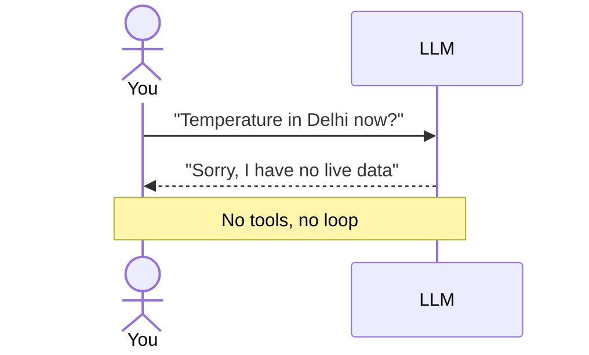

Create **`step1_chat.py`**:

```python
"""
STEP 1 - Just the LLM (this is NOT an agent yet)

Lesson: The model can only generate text. It has no real-time data
(today's weather, the current time) and it cannot take any action.
"""
from config import client, MODEL

question = "What is the temperature in Delhi right now?"
print("You:", question)

response = client.chat.completions.create(
    model=MODEL,
    messages=[{"role": "user", "content": question}],
)

print("LLM:", response.choices[0].message.content)
print("\n>> Notice: the model has no live data. It will either refuse or guess.")
print(">> To fix this, we must give the model TOOLS -> step2_tools.py")
```

### Code walkthrough: step1_chat.py

**Why this file exists:** to prove, with your own eyes, what a plain LLM **cannot** do. This is the "before" picture; the agent is the "after".

**The text at the top in `"""` quotes** is a **docstring**, a note for humans. Python ignores it.

```python
from config import client, MODEL
```

Brings in the ready-made `client` and `MODEL` from `config.py`. This line also runs `config.py`, which prints `[Config] Provider: ...`.

```python
question = "What is the temperature in Delhi right now?"
print("You:", question)
```

The question we want to ask, printed so we can see it on screen.

```python
response = client.chat.completions.create(
    model=MODEL,
    messages=[{"role": "user", "content": question}],
)
```

This is **the call to the LLM**. It is the most important line to understand, because every step uses it.

| Part | Meaning |
|---|---|
| `client.chat.completions.create(...)` | "Send a chat to the LLM and wait for its reply" |
| `model=MODEL` | Which model should answer (e.g. `qwen2.5:7b`) |
| `messages=[...]` | The conversation so far, as a **list** of messages |
| `{"role": "user", "content": question}` | One message. `role` says **who** is speaking, `content` is **what** they said. |

The possible roles you will see in this project:

| Role | Who is speaking |
|---|---|
| `system` | Hidden instructions for the model (used in step 3) |
| `user` | You, the human |
| `assistant` | The model |
| `tool` | The result of a tool that our code ran (used in step 3) |

```python
print("LLM:", response.choices[0].message.content)
```

The reply comes back as an object. `response.choices[0]` is the first (and only) reply, `.message` is the message inside it, and `.content` is its text.

```text
 response
  └── choices           (a list of replies; we asked for one)
       └── [0]
            └── message
                 ├── role:       "assistant"
                 ├── content:    "I don't have access to real-time data..."
                 └── tool_calls: None   (no tools were given, so none requested)
```

The last two `print` lines are just notes for the audience.

Run it:

```bash
python step1_chat.py
```

Example output (yours will differ):

```text
[Config] Provider: ollama | Model: qwen2.5:7b
You: What is the temperature in Delhi right now?
LLM: I don't have access to real-time data. For the current temperature in Delhi,
please check a weather website or app...
```

**Lesson:** The model is smart but **frozen in time**. It has no live data and cannot take actions like saving a file. It either refuses or guesses. We fix this with **tools**.

> **Try it:** change `question` to `"Explain an AI agent in one line"`. For general knowledge, a plain LLM is fine.

---

## 14. Step 2: Give the Model Tools

A **tool** is just a normal Python function. To let the model use it, you need two things:

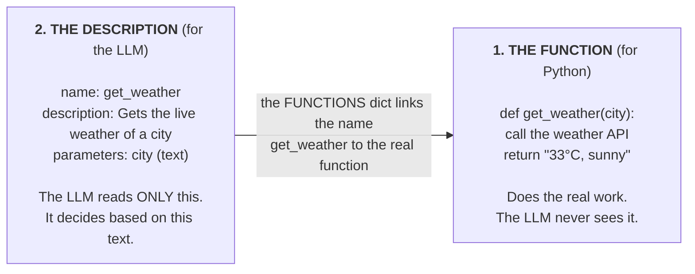

Create **`tools.py`**:

```python
"""
tools.py - The agent's "hands". These are just normal Python functions.

get_weather -> Live weather from the FREE Open-Meteo API (no key needed)
calculator  -> Solves a math expression
get_time    -> Returns the current date and time
save_note   -> Writes a note to notes.txt (shows the agent can take ACTIONS)
"""
import datetime
import json
import urllib.parse
import urllib.request


def _get_json(url):
    with urllib.request.urlopen(url, timeout=10) as r:
        return json.loads(r.read().decode())


def get_weather(city: str) -> str:
    try:
        q = urllib.parse.quote(city)
        geo = _get_json(f"https://geocoding-api.open-meteo.com/v1/search?name={q}&count=1")
        if not geo.get("results"):
            return f"Could not find a city named '{city}'"
        place = geo["results"][0]
        lat, lon = place["latitude"], place["longitude"]
        data = _get_json(
            "https://api.open-meteo.com/v1/forecast"
            f"?latitude={lat}&longitude={lon}&current=temperature_2m,relative_humidity_2m,wind_speed_10m"
        )
        c = data["current"]
        return (f"{place['name']}: {c['temperature_2m']}°C, "
                f"humidity {c['relative_humidity_2m']}%, wind {c['wind_speed_10m']} km/h")
    except Exception:
        # If the internet fails during a workshop, the demo should not stop
        fake = {"delhi": "34°C, sunny", "mumbai": "29°C, rainy", "bangalore": "24°C, cloudy"}
        return fake.get(city.lower(), "25°C, clear sky") + " (offline sample data)"


def calculator(expression: str) -> str:
    try:
        # For demo purposes only. Never use eval() in production code.
        return str(eval(expression, {"__builtins__": {}}, {}))
    except Exception as e:
        return f"Error: {e}"


def get_time() -> str:
    return datetime.datetime.now().strftime("%d %b %Y, %I:%M %p")


def save_note(text: str) -> str:
    with open("notes.txt", "a", encoding="utf-8") as f:
        f.write(f"[{get_time()}] {text}\n")
    return "Note saved to notes.txt"


# Name -> function mapping (the model says a tool name, we run the matching function)
FUNCTIONS = {
    "get_weather": get_weather,
    "calculator": calculator,
    "get_time": get_time,
    "save_note": save_note,
}

# We must tell the model which tools exist and what inputs they need (JSON Schema)
TOOLS = [
    {
        "type": "function",
        "function": {
            "name": "get_weather",
            "description": "Gets the current (live) weather of a city",
            "parameters": {
                "type": "object",
                "properties": {"city": {"type": "string", "description": "City name, e.g. Delhi"}},
                "required": ["city"],
            },
        },
    },
    {
        "type": "function",
        "function": {
            "name": "calculator",
            "description": "Solves a math expression, e.g. '34 - 29' or '(120*3)/4'",
            "parameters": {
                "type": "object",
                "properties": {"expression": {"type": "string"}},
                "required": ["expression"],
            },
        },
    },
    {
        "type": "function",
        "function": {
            "name": "get_time",
            "description": "Returns the current date and time",
            "parameters": {"type": "object", "properties": {}},
        },
    },
    {
        "type": "function",
        "function": {
            "name": "save_note",
            "description": "Saves a note or reminder for the user to a file",
            "parameters": {
                "type": "object",
                "properties": {"text": {"type": "string"}},
                "required": ["text"],
            },
        },
    },
]
```

### Code walkthrough: tools.py

**Why this file exists:** an agent is only as useful as its tools. This file holds **all** the tools in one place, so both step 2 and step 3 can use them. The file has three sections:

```text
 tools.py
 ├── Section A: the functions        get_weather, calculator, get_time, save_note
 ├── Section B: FUNCTIONS            name (text) → real Python function
 └── Section C: TOOLS                descriptions the LLM reads
```

**Section A: the functions**

**Imports:**

```python
import datetime, json, urllib.parse, urllib.request
```

All four are **built into Python**, so nothing extra to install. `datetime` gives the time, `json` reads API replies, and `urllib` makes web requests.

**`_get_json(url)`: a small helper**

```python
def _get_json(url):
    with urllib.request.urlopen(url, timeout=10) as r:
        return json.loads(r.read().decode())
```

Opens a web address, waits at most 10 seconds, and turns the JSON reply into a Python dictionary. The `_` at the start of the name is a convention meaning "internal helper, not a tool".

**`get_weather(city)`: live weather in two API calls**

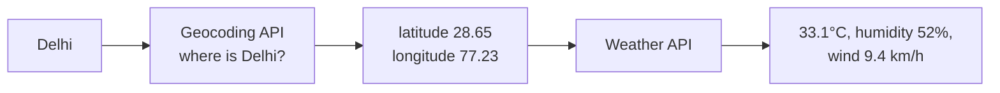

1. The weather API needs coordinates, not a city name, so first we ask Open-Meteo's **geocoding** API: *"where is Delhi?"*
2. If no city is found, we return a friendly message (the LLM will read it and tell the user).
3. Then we ask the **forecast** API for the current temperature, humidity and wind at those coordinates.
4. We return **one short sentence**. Tools should return small, clear text, because the LLM has to read it.

The `try / except` around everything is a **safety net**: if the internet is down during your demo, it returns sample data marked `(offline sample data)` instead of crashing.

**`calculator(expression)`**

```python
return str(eval(expression, {"__builtins__": {}}, {}))
```

`eval("34 - 29")` runs the text as a Python expression and gives `5`. The `{"__builtins__": {}}` part blocks access to dangerous built-in functions. It is still **not safe for real apps**, but fine for a demo. We return a **string** because tool results always go back to the LLM as text.

**`get_time()`**

Returns the current date and time as readable text, e.g. `30 Sep 2026, 11:45 AM`. LLMs do not know the current time, so this is a useful tool.

**`save_note(text)`**

```python
with open("notes.txt", "a", encoding="utf-8") as f:
    f.write(f"[{get_time()}] {text}\n")
```

Opens `notes.txt` in **append** mode (`"a"`: add to the end, do not erase), writes the note with a timestamp, and returns a confirmation. This is the only tool that **changes something** in the real world. It shows that agents can **act**, not just look things up.

**Section B: `FUNCTIONS`**

```python
FUNCTIONS = {"get_weather": get_weather, ...}
```

The LLM replies with the tool name as **text**, like `"get_weather"`. Python needs the **actual function**. This dictionary links the two:

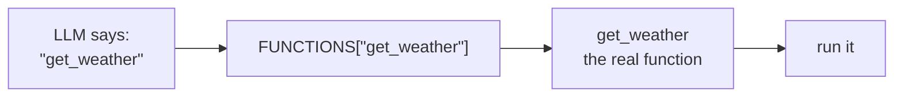

**Section C: `TOOLS`**

A list with one description per tool. Each description has the same shape:

| Field | Meaning |
|---|---|
| `"type": "function"` | Always `function` for tools |
| `"name"` | Must **exactly** match the key in `FUNCTIONS` |
| `"description"` | Plain English: what the tool does. **The LLM chooses tools by reading this.** |
| `"parameters"` | The inputs, in JSON Schema format |
| `"properties"` | Each input's name and type (`string`, `number`, `boolean`...) |
| `"required"` | Which inputs must always be given |

`get_time` has empty `properties` because it needs no input.

**Write good descriptions.** The model picks tools based only on `description` and `parameters`. A vague description like `"does stuff"` leads to wrong choices.

> **Safety note:** `eval()` in `calculator` is fine for a local demo but unsafe in real apps. In production, use a proper math parser.

Check that the tools work on their own (no LLM involved):

```bash
python -c "import tools; print(tools.get_weather('Delhi')); print(tools.calculator('12*7')); print(tools.get_time())"
```

---

## 15. Step 3: Let the Model Ask for a Tool

Send the same question as Step 1, but this time include the tool list.

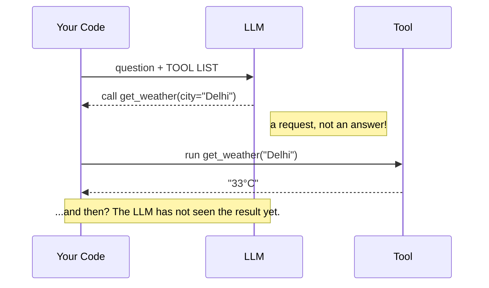

Create **`step2_tools.py`**:

```python
"""
STEP 2 - Show the tools to the model

Lesson: The model does NOT run the tool itself. It only says
"I need get_weather(city='Delhi')". Our code runs the tool.
"""
import json
from config import client, MODEL
from tools import TOOLS, FUNCTIONS

question = "What is the temperature in Delhi right now?"
print("You:", question)

response = client.chat.completions.create(
    model=MODEL,
    messages=[{"role": "user", "content": question}],
    tools=TOOLS,
)
msg = response.choices[0].message

if msg.tool_calls:
    for tc in msg.tool_calls:
        args = json.loads(tc.function.arguments or "{}")
        print(f"\n>> The model asked for a tool: {tc.function.name}({args})")
        result = FUNCTIONS[tc.function.name](**args)
        print(f">> Our code ran the tool. Result: {result}")
    print("\n>> Next, this result must go back to the model, and we must repeat this")
    print(">> until the model gives a final answer. That is the AGENT LOOP -> step3_agent.py")
else:
    print("The model did not ask for a tool:", msg.content)
```

### Code walkthrough: step2_tools.py

**Why this file exists:** to show the **exact moment** where the LLM stops being a chatbot. Instead of text, it sends back a **request to use a tool**.

```python
import json
from config import client, MODEL
from tools import TOOLS, FUNCTIONS
```

We now also import `TOOLS` (descriptions for the LLM) and `FUNCTIONS` (real functions for Python). `json` is needed to read the tool arguments.

```python
response = client.chat.completions.create(
    model=MODEL,
    messages=[{"role": "user", "content": question}],
    tools=TOOLS,
)
```

The same call as step 1, with **one new line**: `tools=TOOLS`. This tells the LLM: *"these tools exist; you may ask for them."*

```python
msg = response.choices[0].message
if msg.tool_calls:
```

Now the reply can be one of two kinds:

```text
 msg.tool_calls is None       ──►  normal text answer in msg.content
 msg.tool_calls has items     ──►  the LLM wants tools; msg.content is usually empty
```

```python
for tc in msg.tool_calls:
    args = json.loads(tc.function.arguments or "{}")
    result = FUNCTIONS[tc.function.name](**args)
```

For each tool request (`tc`):

| Code | Meaning | Example value |
|---|---|---|
| `tc.function.name` | Which tool the LLM wants | `"get_weather"` |
| `tc.function.arguments` | The inputs, as a **JSON string** | `'{"city": "Delhi"}'` |
| `json.loads(...)` | Turns the JSON string into a Python dictionary | `{"city": "Delhi"}` |
| `or "{}"` | If there are no arguments, use an empty dictionary | |
| `FUNCTIONS[...]` | Finds the real Python function | `get_weather` |
| `(**args)` | Passes the dictionary as named inputs | `get_weather(city="Delhi")` |

The LLM may ask for **more than one tool at once** (for example weather for two cities), which is why we loop over `msg.tool_calls`.

**What is missing?** We ran the tool and printed the result, but we **never sent it back** to the LLM. So there is no final answer. Step 3 fixes this.

Run it:

```bash
python step2_tools.py
```

Example output:

```text
[Config] Provider: ollama | Model: qwen2.5:7b
You: What is the temperature in Delhi right now?

>> The model asked for a tool: get_weather({'city': 'Delhi'})
>> Our code ran the tool. Result: Delhi: 33.1°C, humidity 52%, wind 9.4 km/h

>> Next, this result must go back to the model, and we must repeat this
>> until the model gives a final answer. That is the AGENT LOOP -> step3_agent.py
```

**Lesson:** The model did **not** answer the question. It returned a **tool call** (`msg.tool_calls`): a tool name plus arguments. Our code ran the function.

But there is still no final answer, because the model has not seen the result. To finish the job we must:

1. Send the tool result back to the model.
2. Let it decide again (it may need another tool).
3. Repeat until it gives a final answer.

That repetition is the **agent loop**.

---

## 16. Step 4: The Agent Loop (Your First AI Agent)

Create **`step3_agent.py`**:

```python
"""
STEP 3 - The complete AI Agent

AGENT = LLM (brain) + TOOLS (hands) + LOOP (think -> act -> observe -> think again)

The loop:
  1. Send the messages + tools to the model
  2. If the model asks for a tool -> run it -> add the result to messages -> go to step 1
  3. If the model does not ask for a tool -> that is the final answer
"""
import json
from config import client, MODEL
from tools import TOOLS, FUNCTIONS

SYSTEM_PROMPT = (
    "You are a helpful AI assistant. Use the given tools for live data, "
    "calculations, the current time, or saving notes. Keep answers short and clear."
)
MAX_STEPS = 6   # Safety limit to avoid an infinite loop


def run_agent(user_msg, history):
    history.append({"role": "user", "content": user_msg})

    for step in range(1, MAX_STEPS + 1):
        response = client.chat.completions.create(
            model=MODEL, messages=history, tools=TOOLS
        )
        msg = response.choices[0].message

        # No tool needed -> this is the final answer
        if not msg.tool_calls:
            history.append({"role": "assistant", "content": msg.content})
            return msg.content

        # Save the model's tool request in the history
        history.append({
            "role": "assistant",
            "content": msg.content or "",
            "tool_calls": [tc.model_dump() for tc in msg.tool_calls],
        })

        # Run every requested tool and send the result back
        for tc in msg.tool_calls:
            name = tc.function.name
            args = json.loads(tc.function.arguments or "{}")
            print(f"   [Step {step}] Tool: {name}({args})")
            try:
                result = FUNCTIONS[name](**args)
            except Exception as e:
                result = f"Tool error: {e}"
            print(f"   [Step {step}] Result: {result}")
            history.append({"role": "tool", "tool_call_id": tc.id, "content": str(result)})

    return "Reached the maximum number of steps without a final answer."


if __name__ == "__main__":
    history = [{"role": "system", "content": SYSTEM_PROMPT}]
    print("AI Agent is ready! (type 'exit' to quit)\n")
    print("Try these:")
    print("  - What is the weather in Delhi?")
    print("  - What is the temperature difference between Delhi and Mumbai?")
    print("  - What time is it? Save it as a note.\n")

    while True:
        q = input("You: ").strip()
        if q.lower() in ("exit", "quit"):
            break
        if not q:
            continue
        print("Agent:", run_agent(q, history), "\n")
```

### Code walkthrough: step3_agent.py

**Why this file exists:** this is the **real AI agent**. It combines everything: the LLM (`config.py`), the tools (`tools.py`), instructions, memory and the loop. The file has four parts:

```text
 step3_agent.py
 ├── Part 1: settings        SYSTEM_PROMPT, MAX_STEPS
 ├── Part 2: run_agent()     the agent loop (the brain of the file)
 ├── Part 3: tool handling   run each requested tool, save results
 └── Part 4: chat loop       read your input, call run_agent(), print the answer
```

**Part 1: Settings**

```python
SYSTEM_PROMPT = ("You are a helpful AI assistant. Use the given tools ...")
MAX_STEPS = 6
```

- `SYSTEM_PROMPT` is the agent's **job description**. It is sent first, with role `system`. Change it and the agent's behavior changes (try: *"Always answer like a pirate"*).
- `MAX_STEPS` stops the loop after 6 rounds, in case the model gets confused and keeps calling tools forever.

**Part 2: `run_agent(user_msg, history)`**

```python
def run_agent(user_msg, history):
    history.append({"role": "user", "content": user_msg})
```

- `history` is the agent's **memory**: a list of every message so far. It is created **once** at the start and **reused** for every question, so the agent remembers earlier questions.
- First, we add your new question to the memory.

```python
    for step in range(1, MAX_STEPS + 1):
        response = client.chat.completions.create(model=MODEL, messages=history, tools=TOOLS)
        msg = response.choices[0].message
```

- `for step in range(1, MAX_STEPS + 1)` repeats the loop at most 6 times (step = 1, 2, ... 6).
- Each round sends the **whole history** plus the tools. This is the **THINK** step.

```python
        if not msg.tool_calls:
            history.append({"role": "assistant", "content": msg.content})
            return msg.content
```

- **No tool requested** means the LLM has its final answer.
- We save that answer in memory (so follow-up questions work) and **return** it. `return` also ends the loop.

**Part 3: Tool handling**

```python
        history.append({
            "role": "assistant",
            "content": msg.content or "",
            "tool_calls": [tc.model_dump() for tc in msg.tool_calls],
        })
```

- The LLM asked for tools. We save **its request** in memory first. Without this, the LLM would later see tool results without knowing it asked for them, and get confused.
- We build this message by hand with only the three fields every provider accepts: `role`, `content` and `tool_calls`. `tc.model_dump()` turns each tool request object into a plain dictionary. (Some models, like `gpt-oss`, also send extra fields such as their private reasoning. Copying the whole reply back can cause errors, so we keep only what is needed.)

```python
        for tc in msg.tool_calls:
            name = tc.function.name
            args = json.loads(tc.function.arguments or "{}")
            print(f"   [Step {step}] Tool: {name}({args})")
            try:
                result = FUNCTIONS[name](**args)
            except Exception as e:
                result = f"Tool error: {e}"
            print(f"   [Step {step}] Result: {result}")
            history.append({"role": "tool", "tool_call_id": tc.id, "content": str(result)})
```

This is the **ACT** and **OBSERVE** step:

1. Read the tool name and arguments (same as step 2).
2. **Print** what is happening, so you can watch the agent think. These `[Step ...]` lines are the best part of a live demo.
3. Run the tool inside `try / except`. If the tool fails, or the LLM invents a tool that does not exist, we do **not** crash. We send the error back as the result, and the LLM can try something else.
4. Save the result in memory with role `tool`. The `tool_call_id` tells the LLM **which request** this result answers (important when it asked for several tools at once).

Then the `for step` loop goes around again, and the LLM **thinks** with the new information.

```python
    return "Reached the maximum number of steps without a final answer."
```

Only reached if all 6 steps are used up without a final answer.

**Part 4: The chat loop**

```python
if __name__ == "__main__":
```

This means: *"run the code below only when this file is started directly"* (`python step3_agent.py`), not when another file imports it. It lets you reuse `run_agent()` later, for example in a web app.

```python
    history = [{"role": "system", "content": SYSTEM_PROMPT}]
```

Creates the memory, starting with the system prompt. This happens **once**, so memory lasts for the whole chat session (until you type `exit`).

```python
    while True:
        q = input("You: ").strip()
        if q.lower() in ("exit", "quit"):
            break
        if not q:
            continue
        print("Agent:", run_agent(q, history), "\n")
```

| Code | Meaning |
|---|---|
| `while True:` | Repeat forever, until `break` |
| `input("You: ")` | Wait for you to type a question |
| `.strip()` | Remove extra spaces at the start and end |
| `break` | Leave the loop if you type `exit` or `quit` |
| `continue` | If you pressed Enter without typing, skip and ask again |
| `run_agent(q, history)` | Run the agent and print its final answer |

### How `run_agent()` works

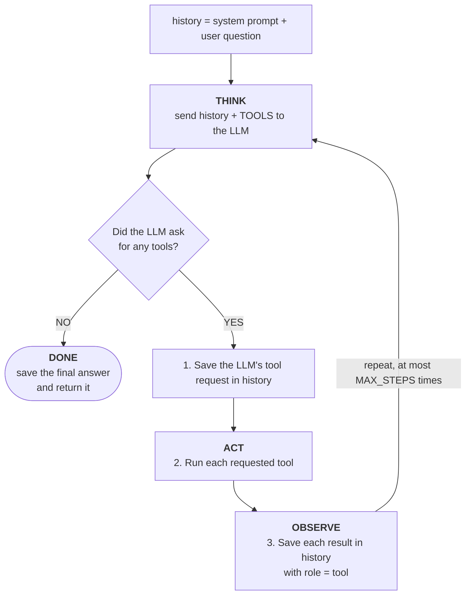

| Line / concept | Why it matters |
|---|---|
| `role: "system"` | The agent's instructions: who it is, what rules to follow. |
| `if not msg.tool_calls` | No tool requested means this is the final answer. |
| `history.append({"role": "assistant", ...})` | The model must "remember" that it asked for a tool. |
| `role: "tool"` with `tool_call_id` | Links each result to the exact request it answers. |
| `MAX_STEPS = 6` | A safety limit so a confused model cannot loop forever. |
| `try / except` around the tool | A failing tool sends an error message back to the model instead of crashing the program. The model can retry or explain. |

### Watch the memory grow

For the question *"Temperature difference between Delhi and Mumbai?"*, this is what `history` looks like after each round. The **whole list** is sent to the LLM every time. That is how it "remembers".

```text
 Round 1 (sent to LLM)            Round 2 (sent to LLM)            Round 3 (sent to LLM)
 ─────────────────────            ─────────────────────            ─────────────────────
 [system] You are helpful...      [system] You are helpful...      [system] You are helpful...
 [user]   Delhi vs Mumbai?        [user]   Delhi vs Mumbai?        [user]   Delhi vs Mumbai?
                                  [assistant] call get_weather     [assistant] call get_weather
                                              (Delhi), (Mumbai)                (Delhi), (Mumbai)
                                  [tool] Delhi: 33.1°C             [tool] Delhi: 33.1°C
                                  [tool] Mumbai: 28.4°C            [tool] Mumbai: 28.4°C
                                                                   [assistant] call calculator
                                                                               (33.1 - 28.4)
                                                                   [tool] 4.7
        │                                │                                │
        ▼                                ▼                                ▼
 LLM: "call get_weather x2"       LLM: "call calculator"           LLM: "Delhi is 4.7°C warmer"
                                                                        → FINAL ANSWER
```

### Run your agent

```bash
python step3_agent.py
```

Try these prompts one by one and watch the `[Step ...]` lines:

| Prompt | What you should see |
|---|---|
| `What is the weather in Delhi?` | One tool call (`get_weather`) |
| `What is the temperature difference between Delhi and Mumbai?` | **Multi-step**: `get_weather` twice, then `calculator` |
| `What time is it? Save it as a note.` | `get_time`, then `save_note`. Check the new `notes.txt` file. |
| `Hi, who are you?` | No tool calls, just a direct answer |
| `Now what about Bangalore?` (after a weather question) | Uses memory to understand you mean weather |

Type `exit` to quit.

### Map it back to the theory

```mermaid
flowchart LR
  t1["1. LLM"] --> c1["client + MODEL<br/><i>config.py</i>"]
  t2["2. Instructions"] --> c2["SYSTEM_PROMPT<br/><i>step3_agent.py</i>"]
  t3["3. Tools"] --> c3["FUNCTIONS + TOOLS<br/><i>tools.py</i>"]
  t4["4. Memory"] --> c4["history list<br/><i>step3_agent.py</i>"]
  t5["5. Loop"] --> c5["for step in range(...)<br/><i>run_agent()</i>"]
```

**Congratulations. You have built a working AI agent.** Every agent framework (LangChain, Google ADK, CrewAI, OpenAI Agents SDK) runs this same loop inside, with more features around it.

---

## 17. Step 5: Switch to a Free Cloud Model

Useful if your laptop is slow, has little RAM, or you want to compare models. **Your agent code does not change**; you only edit `.env`.

### Option A: Google Gemini (free tier)

1. Go to [aistudio.google.com/apikey](https://aistudio.google.com/apikey) and sign in with a Google account.
2. Click **Create API key** and copy it.
3. Edit `.env`:
   ```bash
   PROVIDER=gemini
   GEMINI_API_KEY=paste-your-key-here
   ```

### Option B: Groq (free tier, very fast)

> **Groq is not Grok.** **Groq** (groq.com) is a company that runs open models on very fast chips; its keys start with `gsk_`. **Grok** is a different AI model made by xAI. This guide uses **Groq**.

**1. Get a free key**

1. Go to [console.groq.com/keys](https://console.groq.com/keys) and sign up (no credit card needed).
2. Click **Create API Key**, give it any name, and copy it. It starts with `gsk_`.
3. Paste it into `.env`:
   ```bash
   GROQ_API_KEY=gsk_your_key_here
   GROQ_MODEL=openai/gpt-oss-20b
   ```
   No spaces around `=` and no quotes.

**2. Check which models your key can use**

Groq adds and removes models from time to time, so first ask Groq which models are available to **your** key:

```bash
PROVIDER=groq python -c "from config import client; print('\n'.join(sorted(m.id for m in client.models.list())))"
```

Example output:

```text
[Config] Provider: groq | Model: openai/gpt-oss-20b
allam-2-7b
openai/gpt-oss-120b
openai/gpt-oss-20b
qwen/qwen3.8-27b
whisper-large-v3
...
```

Pick a **chat model that supports tool calling**:

| Model | Notes |
|---|---|
| `openai/gpt-oss-20b` | **Recommended.** Fast, good at tool calling. Tested with this project. |
| `openai/gpt-oss-120b` | Bigger and smarter, a little slower |

Do not pick `whisper-...` (speech-to-text), `...prompt-guard...` or `...safeguard...` (safety filters) or `orpheus...` (text-to-speech). They are not chat models.

> **Got `404 model_not_found`?** The model in `GROQ_MODEL` is not in your list (for example, `llama-3.3-70b-versatile` is no longer available on many accounts). Change `GROQ_MODEL` to a model from the list above.

**3. Run the agent on Groq**

Either change the provider permanently in `.env`:

```bash
PROVIDER=groq
```

and run:

```bash
python step3_agent.py
```

**or** switch for **one run only**, without editing any file:

```bash
PROVIDER=groq python step3_agent.py
```

The first line should now show:

```text
[Config] Provider: groq | Model: openai/gpt-oss-20b
```

Ask `What is the temperature difference between Delhi and Mumbai?`. You will see the same `[Step ...]` tool calls as with Ollama, but the answer arrives much faster. Same tools, same loop, different brain.

> **Workshop tip:** run `PROVIDER=ollama python step3_agent.py` and then `PROVIDER=groq python step3_agent.py` one after the other. The audience sees the **exact same agent code** running on a local model and on a cloud model.

### Why `gpt-oss` needed a small code change

`gpt-oss` is a **reasoning model**: along with its reply, it sends back extra fields (such as its private reasoning). In `step3_agent.py` we save the model's tool request into `history` with only three fields, `role`, `content` and `tool_calls`, instead of copying the whole reply. This keeps the request valid for **every** provider (Ollama, Gemini and Groq).

### Local vs cloud at a glance

| | Ollama (local) | Gemini / Groq (cloud) |
|---|---|---|
| Cost | Free | Free tier (with limits) |
| Internet needed | Only for tools like weather | Yes |
| API key | No | Yes |
| Privacy | Data stays on your laptop | Data goes to the provider |
| Speed | Depends on your laptop | Usually fast (Groq is very fast) |

> Free tiers have rate limits (requests per minute and per day). If you see a `429` error, wait a minute or switch provider. Model names change over time; if a model is not found, list the models again and update `GEMINI_MODEL` or `GROQ_MODEL` in `.env`.

To go back to the local model, set `PROVIDER=ollama`.

---

## 18. Exercise: Add Your Own Tool

Adding a tool always takes the same **three steps**, all in `tools.py`:

```mermaid
flowchart LR
  A["1. Write the function<br/>it does the work"] --> B["2. Add it to FUNCTIONS<br/>name → function"] --> C["3. Describe it in TOOLS<br/>so the LLM knows it exists"]
```

Example: a tool that converts Indian Rupees to US Dollars.

**1. Write the function**

```python
def inr_to_usd(amount: float) -> str:
    rate = 0.012   # fixed demo rate
    return f"{amount} INR = {round(amount * rate, 2)} USD"
```

**2. Register it in `FUNCTIONS`**

```python
FUNCTIONS = {
    "get_weather": get_weather,
    "calculator": calculator,
    "get_time": get_time,
    "save_note": save_note,
    "inr_to_usd": inr_to_usd,      # new
}
```

**3. Describe it in `TOOLS`** (add this item to the list)

```python
    {
        "type": "function",
        "function": {
            "name": "inr_to_usd",
            "description": "Converts an amount in Indian Rupees (INR) to US Dollars (USD)",
            "parameters": {
                "type": "object",
                "properties": {"amount": {"type": "number", "description": "Amount in INR"}},
                "required": ["amount"],
            },
        },
    },
```

Restart the agent and ask: `How many dollars is 5000 rupees?`

**More ideas:** a random joke tool, a to-do list (add and list tasks in a file), a "read my notes" tool that reads `notes.txt`, a word counter, or a Wikipedia summary lookup.

---
---

# PART 3: GO DEEPER

You have built a single agent. This part explains the bigger ideas you will hear about, in simple words.

---

## 19. Memory: Short-Term and Long-Term

Memory lets an agent keep track of what already happened.

```mermaid
flowchart LR
  S["<b>SHORT-TERM MEMORY</b><br/><br/>The current conversation (our history list)<br/>Sent to the LLM on every call<br/>Lost when the program stops<br/><br/><i>Like: what you remember from this meeting</i>"]
  L["<b>LONG-TERM MEMORY</b><br/><br/>Saved outside the conversation<br/>(file, database, vector DB)<br/>Looked up only when needed<br/>Survives restarts<br/><br/><i>Like: your diary or contact list</i>"]
  S ~~~ L
```

**Problem:** LLMs have a **context window**, a maximum amount of text they can read at once. In a long chat, `history` grows until it no longer fits.

**Common fixes:**
- **Trim:** keep only the last N messages.
- **Summarize:** replace old messages with a short summary.
- **Retrieve:** store facts in long-term memory and fetch only the relevant ones.

> **Try it:** save `history` to a JSON file when the program exits and load it on start. Your agent now remembers across runs.

---

## 20. Types of AI Agents

All agents use the loop, but they organize their thinking in different ways. These are the most common patterns.

### 20.1 ReAct Agent (Reason + Act): the most common

Thinks one step, acts, observes, thinks again. **This is what you built.**

```text
 Thought:     I need the weather in Delhi.
 Action:      get_weather(city="Delhi")
 Observation: 33.1°C
 Thought:     Now I need Mumbai.
 Action:      get_weather(city="Mumbai")
 Observation: 28.4°C
 Thought:     Now subtract.
 Action:      calculator("33.1 - 28.4")
 Observation: 4.7
 Thought:     I have everything.
 Answer:      Delhi is 4.7°C warmer.
```

**Best for:** most everyday tasks.

### 20.2 Plan-and-Execute Agent

Makes the **whole plan first**, then does each step.

```mermaid
flowchart LR
  G(["Goal"]) --> P["PLANNER"] --> PL["Plan:<br/>Step 1: search flights<br/>Step 2: check calendar<br/>Step 3: pick the best flight<br/>Step 4: book it"] --> E["EXECUTOR<br/>runs steps 1 to 4"] --> R(["Result"])
  E -. "re-plan if needed" .-> P
```

**Best for:** long, complex tasks where a clear plan helps.

### 20.3 Reflection Agent

Writes a draft, **criticizes its own work**, then improves it.

```mermaid
flowchart LR
  G(["Goal"]) --> W["Write draft"] --> R["Review:<br/>what is wrong?"] --> I["Improve"] --> Q{"Good enough?"}
  Q -- "No, repeat" --> R
  Q -- Yes --> F(["Final"])
```

**Best for:** writing, code and anything where quality matters more than speed.

### 20.4 Agentic RAG

**RAG** means **Retrieval-Augmented Generation**: before answering, look up relevant documents and give them to the LLM. In **agentic** RAG, the agent **decides itself** whether it needs to search, what to search for, and whether to search again.

```mermaid
flowchart TD
  Q(["Question"]) --> A{"Agent: do I need to<br/>look something up?"}
  A -- NO --> D(["Answer directly"])
  A -- YES --> S["Search documents"] --> E{"Is this enough?"}
  E -- "NO: search again<br/>with a better query" --> S
  E -- YES --> F(["Answer using the documents"])
```

**Best for:** chat with your PDFs, company knowledge bases, support docs.

### 20.5 Multi-Agent System

Several agents, each with **one job**, work together as a team. See the next section.

| Type | One-line idea | Speed | Quality |
|---|---|---|---|
| ReAct | Think, act, repeat | Fast | Good |
| Plan-and-Execute | Plan first, then do | Medium | Good for long tasks |
| Reflection | Draft, review, improve | Slow | High |
| Agentic RAG | Search your data when needed | Medium | High for knowledge questions |
| Multi-Agent | A team of specialists | Slower | High for big tasks |

---

## 21. Multi-Agent Systems

One agent doing everything gets confused, just like one person doing every job in a company. So we split the work between **specialist agents**.

**Example: a trip planner**

```mermaid
flowchart TD
  U(["Plan a 3-day Goa trip"]) --> M["<b>MANAGER AGENT</b><br/>(orchestrator)"]
  M <--> F["<b>FLIGHT AGENT</b><br/>tool: search flights"]
  M <--> H["<b>HOTEL AGENT</b><br/>tool: search hotels"]
  M <--> A["<b>ACTIVITIES AGENT</b><br/>tools: maps, reviews"]
  M --> R(["Final trip plan"])
```

**Why use many agents?**
- Each agent has a **short, focused prompt** and only the tools it needs, so it makes fewer mistakes.
- Agents can work **in parallel**, which is faster.
- One agent can **check** another agent's work.

**Rule of thumb:** give each agent **one clear job**.

---

## 22. How Agents Talk to Each Other

In a multi-agent system, agents must send messages to each other. A **message** is usually JSON with a few standard fields:

```json
{
  "from": "research_agent",
  "to": "writer_agent",
  "type": "result",
  "content": "Top 3 beaches in Goa: Palolem, Baga, Anjuna",
  "context": { "task_id": "trip-42", "step": 2 }
}
```

There are **four common ways** to connect agents.

### 22.1 Direct (one-to-one)

```mermaid
flowchart LR
  A["Agent A"] <--> B["Agent B"]
```

Agents message each other directly, like a phone call.
- **Good:** simple, fast.
- **Bad:** with many agents, the connections become a mess.

### 22.2 Centralized (manager in the middle)

```mermaid
flowchart TD
  M["MANAGER"]
  A["Agent A"] <--> M
  B["Agent B"] <--> M
  C["Agent C"] <--> M
  D["Agent D"] <--> M
```

Everyone talks only to the manager, like a team lead.
- **Good:** easy to control, monitor and add new agents.
- **Bad:** the manager can become a bottleneck.

### 22.3 Broadcast (one-to-many, publish/subscribe)

```mermaid
flowchart LR
  A["Agent A<br/>New order no. 55"] --> B["Agent B<br/>interested: acts"]
  A --> C["Agent C<br/>not interested: ignores"]
  A --> D["Agent D<br/>interested: acts"]
```

One agent announces something; any agent that cares reacts, like a group announcement.
- **Good:** flexible, easy to add listeners.
- **Bad:** harder to track who did what.

### 22.4 Shared Memory (blackboard)

```mermaid
flowchart LR
  A["Agent A"] -- write --> BB[("SHARED BLACKBOARD<br/>common memory / database")]
  D["Agent D"] -- write --> BB
  BB -- read --> B["Agent B"]
  BB -- read --> C["Agent C"]
```

Agents never message each other. They read and write a common space, like a shared whiteboard in an office.
- **Good:** everyone sees the same state.
- **Bad:** two agents writing at the same time can clash.

| Pattern | Real-life example | Use when |
|---|---|---|
| Direct | Phone call | 2 or 3 agents, simple flow |
| Centralized | Team lead assigning work | You need control and visibility |
| Broadcast | WhatsApp group announcement | Many agents may react to events |
| Shared Memory | Office whiteboard | Agents build on each other's work |

Real systems often **mix** these. For example, a manager controls the flow while worker agents share a common memory.

---

## 23. MCP and A2A: The Standard Protocols

A **protocol** is an agreed set of rules for talking, like everyone agreeing to use the same plug shape. Two open protocols are becoming the standard for agents.

### 23.1 MCP (Model Context Protocol): agent ↔ tools

**Problem:** Every app (GitHub, Slack, Google Drive, a database) has a different API. Writing custom tool code for each one is slow.

**Solution:** MCP is a standard way to connect an agent to tools and data. A tool provider builds **one MCP server**, and **any** MCP-compatible agent can use it.

```mermaid
flowchart LR
  subgraph WO["❌ WITHOUT MCP: new code for every tool"]
    direction LR
    A1["Agent"] -- custom code --> G1["GitHub"]
    A1 -- custom code --> S1["Slack"]
    A1 -- custom code --> D1["Database"]
  end
  subgraph WI["✅ WITH MCP: one standard, plug and play"]
    direction LR
    A2["Agent"] --> M["MCP"]
    M --> G2["GitHub server"]
    M --> S2["Slack server"]
    M --> D2["Database server"]
  end
  WO ~~~ WI
```

Think of MCP as the **USB-C port for AI tools**.

### 23.2 A2A (Agent2Agent Protocol): agent ↔ agent

**Problem:** Agents built by different companies or frameworks cannot understand each other.

**Solution:** A2A is a standard way for agents to discover each other, share tasks and send results, even across companies.

```mermaid
sequenceDiagram
  participant Y as Your travel agent (built with ADK)
  participant A as Airline booking agent (another company)
  Y->>A: A2A: "Book seat 12A"
  A-->>Y: A2A: "Confirmed, PNR X"
```

### 23.3 How they fit together

```mermaid
flowchart TB
  A1["Agent 1"] <-->|"A2A: agent ↔ agent"| A2["Agent 2"]
  A1 -->|"MCP: agent ↔ tools"| T1["Tools and data"]
  A2 -->|"MCP: agent ↔ tools"| T2["Tools and data"]
```

| | MCP | A2A |
|---|---|---|
| Connects | Agent to **tools and data** | Agent to **other agents** |
| Analogy | USB-C port | A shared business language |
| Example | Agent reads your GitHub issues | Your agent asks an airline's agent to book a seat |

Both are open standards and work **together**, not against each other. Other ways agents communicate include plain **HTTP/REST APIs** and **message queues** (like Kafka or RabbitMQ) for sending messages that are processed later.

---

## 24. What Goes Wrong (and How to Fix It)

Building the "happy path" is easy. Real agent work is mostly about handling what goes wrong.

| Problem | What happens | Fix |
|---|---|---|
| **Infinite loop** | Agent keeps calling the same tool again and again | Set a **max steps** limit (we use `MAX_STEPS`) |
| **Wrong tool** | Agent picks the calculator for a weather question | Write **clear, specific tool descriptions** |
| **Made-up tools or inputs** | Agent calls a tool that does not exist, or passes bad inputs | **Validate** the call and send the error back so it can retry (our `try/except`) |
| **Context overflow** | History becomes too long for the model | **Trim or summarize** old messages |
| **Stops too early** | Agent answers before finishing the task | Say clearly in the system prompt **when the task is done** |
| **Unsafe actions** | Agent sends an email or pays money by mistake | Ask a **human to approve** risky actions |
| **Bad information spreads** (multi-agent) | One agent's mistake is used by the others | Add a **reviewer** agent; validate messages |
| **Agents talking forever** (multi-agent) | Two agents keep replying to each other | Limit the **number of messages** per task |

**Best practices:**
- Give each agent **one clear job**.
- Keep tools **small and focused**, with good descriptions.
- **Log** every step (like our `[Step ...]` prints), so you can see what the agent did.
- **Fail gracefully:** return an error message to the model instead of crashing.
- Require **human approval** for anything involving money, messages or deleting data.

---

## 25. When to Use an Agent (and When Not To)

Agents are powerful but slower, costlier and less predictable than normal code.

```mermaid
flowchart TD
  Q1{"Does the task need<br/>multiple steps?"}
  Q1 -- NO --> R1["A single LLM call is enough"]
  Q1 -- YES --> Q2{"Are the steps<br/>always the same?"}
  Q2 -- YES --> R2["Normal code / fixed pipeline<br/>no agent needed"]
  Q2 -- NO --> Q3{"Does the next step depend<br/>on the previous result?"}
  Q3 -- YES --> R3(["USE AN AGENT"])
  Q3 -- NO --> R2
```

| Use an agent when... | Do NOT use an agent when... |
|---|---|
| The task needs several steps | One LLM call already solves it |
| The next step depends on earlier results | The steps are always the same |
| It needs live data or real actions | Speed and cost matter most |
| The path is flexible | You need the exact same output every time |

---

## 26. Real AI Agents You Already Know

| Type | Examples | What they do |
|---|---|---|
| Coding agents | Claude Code, Cursor, GitHub Copilot | Read your code, edit files, run tests, fix errors |
| Research agents | Deep Research, Perplexity | Search many sources and write a report |
| Browser agents | Computer-use agents | Click, type and fill forms on websites |
| Support agents | Customer support bots | Look up orders, answer questions, raise tickets |
| Data agents | Data analysis assistants | Query databases, make charts, explain results |
| Personal assistants | Calendar / email assistants | Schedule meetings, draft replies |

All of them use the same idea you built today: **LLM + tools + memory + loop**.

---

## 27. Troubleshooting

| Problem | Fix |
|---|---|
| `command not found: ollama` | Ollama is not installed or not on PATH. Reinstall from [ollama.com/download](https://ollama.com/download) and open a new terminal. |
| Typing `ollama` shows a menu (Claude Code, OpenCode...) | Press `Esc`. Use full commands like `ollama pull qwen2.5:7b`. |
| `Connection refused` / `APIConnectionError` | The Ollama server is not running. Open the Ollama app (macOS/Windows) or run `ollama serve` (Linux). |
| Groq `404 model_not_found` (e.g. `llama-3.3-70b-versatile`) | Groq changes its models over time. List the models your key can use with `PROVIDER=groq python -c "from config import client; print('\n'.join(sorted(m.id for m in client.models.list())))"` and set `GROQ_MODEL` in `.env` to one of them (e.g. `openai/gpt-oss-20b`). |
| `model "qwen2.5:7b" not found` | Run `ollama pull qwen2.5:7b`, or set `OLLAMA_MODEL` in `.env` to a model shown by `ollama list`. |
| `ModuleNotFoundError: No module named 'openai'` | The venv is not active. Run `source venv/bin/activate` (or the Windows version), then `pip install -r requirements.txt`. |
| `GEMINI_API_KEY is missing` / `GROQ_API_KEY is missing` | The key is empty in `.env`, or `.env` is not in the folder you ran the script from. |
| Error `429` | Free-tier rate limit. Wait a minute or switch `PROVIDER`. |
| Error `401` / `403` | The API key is wrong or has extra spaces. Create a new one. |
| The agent answers without using a tool | Small models sometimes skip tools. Use `qwen2.5:7b` or bigger, ask a more specific question, or improve the tool `description`. |
| Weather shows `(offline sample data)` | Your internet is off or blocked. The demo still works; connect to the internet for live data. |
| Very slow replies | Close heavy apps, use a smaller model (`qwen2.5:3b`), or switch to Groq. |
| `zsh compinit: insecure directories` warning on macOS | Not related to this project. Fix once with `compaudit \| xargs chmod g-w`. |

---

## 28. Glossary

| Term | Simple meaning |
|---|---|
| **LLM** | Large Language Model. An AI that reads text and writes text. |
| **AI Agent** | An LLM that can decide steps, use tools and work in a loop until a goal is done. |
| **Prompt** | The text you send to the LLM. |
| **System prompt** | Hidden instructions that set the agent's role and rules. |
| **Tool / Function calling** | The LLM asking your code to run a function with certain inputs. |
| **JSON Schema** | A standard format to describe what inputs a tool needs. |
| **Agent loop** | Think → Act → Observe → repeat, until the goal is done. |
| **Observation** | The result of a tool, fed back to the LLM. |
| **Memory / history** | The record of what happened, sent to the LLM each time. |
| **Context window** | The maximum amount of text an LLM can read at once. |
| **Token** | A small piece of text (about ¾ of a word). LLM limits and prices are counted in tokens. |
| **Parameters (7b, 14b)** | The size of a model, in billions. Bigger is usually smarter but slower. |
| **Ollama** | Free app to run LLMs on your own computer. |
| **OpenAI-compatible API** | A common request format that many providers (Ollama, Gemini, Groq) accept. |
| **RAG** | Retrieval-Augmented Generation. Look up documents first, then answer. |
| **ReAct** | Reason + Act. The think-act-observe agent pattern. |
| **Multi-agent system** | Several specialist agents working together. |
| **Orchestrator** | The manager agent that assigns work to other agents. |
| **MCP** | Model Context Protocol. A standard for connecting agents to tools and data. |
| **A2A** | Agent2Agent Protocol. A standard for agents to talk to other agents. |
| **Rate limit** | The maximum number of requests a free (or paid) API allows per minute or day. |

---

## 29. What Next?

You now understand the core of **every** AI agent framework.

```mermaid
flowchart TD
  S1["1. Single agent from scratch<br/><b>you are here</b>"] --> S2["2. Add long-term memory<br/>save history to a file / database"]
  S2 --> S3["3. Add real tools<br/>news, calendar, database, web search"]
  S3 --> S4["4. Add a UI<br/>Streamlit or Gradio"]
  S4 --> S5["5. Try a framework<br/>LangChain, Google ADK, CrewAI, OpenAI Agents SDK"]
  S5 --> S6["6. Build a multi-agent system<br/>and connect tools with MCP"]
```

Ideas:
- **Better memory:** save `history` to a JSON file so the agent remembers across runs.
- **Real APIs as tools:** news, stock prices, your calendar, a database.
- **A UI:** wrap `run_agent()` in a small web app with [Streamlit](https://streamlit.io) or [Gradio](https://gradio.app).
- **Guardrails:** ask the user to confirm before a tool does something risky.
- **Frameworks:** rebuild this project in LangChain or Google ADK and compare how much code the framework saves.

---

### Quick Reference

```bash
# one-time setup
ollama pull qwen2.5:7b
python3 -m venv venv
source venv/bin/activate          # Windows: venv\Scripts\activate
pip install -r requirements.txt
cp .env.example .env              # Windows: copy .env.example .env

# run the steps
python step1_chat.py              # plain LLM
python step2_tools.py             # model asks for a tool
python step3_agent.py             # full AI agent
```

### Further Reading

- [Ollama](https://ollama.com)
- [Model Context Protocol](https://modelcontextprotocol.io)

Happy building!

---

## About the Author

**Anand Gaur**

For more details about my **books**, **services** and other resources, visit my website: **[anandgaur.com](https://anandgaur.com)**

### 🔗 Follow, Subscribe and Connect with Me

| | Platform | Link |
|---|---|---|
| 🌐 | **Website** | [anandgaur.com](https://anandgaur.com) |
| 💼 | **LinkedIn** | [linkedin.com/in/anandgaur22](https://www.linkedin.com/in/anandgaur22) |
| 📖 | **Medium** | [medium.com/@anandgaur2207](https://medium.com/@anandgaur2207) |
| 📸 | **Instagram** | [instagram.com/tech.anandgaur](https://www.instagram.com/tech.anandgaur) |
| ▶️ | **YouTube** | [youtube.com/@technicalanandgaur](https://www.youtube.com/@technicalanandgaur) |
| 💻 | **GitHub** | [github.com/anandgaur22](https://github.com/anandgaur22) |

If this guide helped you, share it with a friend who wants to learn AI agents.
