# AI Agents: From Zero to Your First Working Agent (100% Free)

> **Ye Hinglish version hai**, samajhne ke liye. Content bilkul English `README.md` jaisa hi hai. Code, commands aur diagrams same rakhe hain, sirf explanation Hinglish me hai.

Ye AI agents ki ek complete guide hai, simple bhasha me. Shuruaat hoti hai **AI agent kya hota hai** se, aur end hota hai **ek aise agent pe jo aapne khud banaya aur chalaya**. Uske baad advanced concepts bhi cover kiye gaye hain.

- AI ka koi pehle se knowledge nahi chahiye. Har naya shabd pehli baar aate hi samjhaya gaya hai.
- Koi paid API ya credit card nahi chahiye. Sab kuch **free** models se chalta hai.
- Agar aap ek Python script chala sakte ho, to ye guide poori kar sakte ho.

Upar se neeche tak padho. End tak aapko AI agents ke basics samajhne ke liye koi aur tutorial padhne ki zarurat nahi padegi.

---

## How This Guide Is Organized

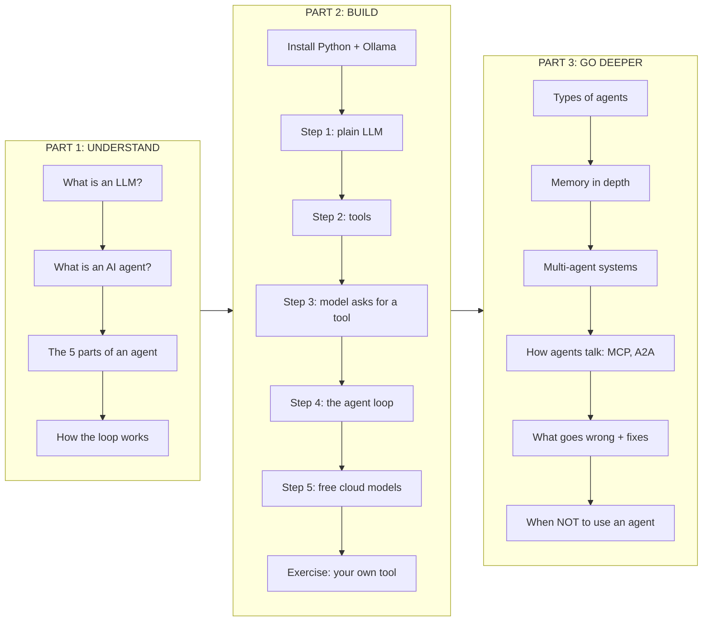

## Table of Contents

**Part 1: Understand AI Agents**

1. [Start Here: What Is an LLM?](#1-start-here-what-is-an-llm)
2. [LLM vs Chatbot vs AI Agent](#2-llm-vs-chatbot-vs-ai-agent)
3. [A Real-Life Example](#3-a-real-life-example)
4. [The 5 Parts of Every AI Agent](#4-the-5-parts-of-every-ai-agent)
5. [The Agent Loop: Think, Act, Observe](#5-the-agent-loop-think-act-observe)
6. [Tool Calling: The Most Important Idea](#6-tool-calling-the-most-important-idea)

**Part 2: Build Your Agent**

7. [What You Will Build](#7-what-you-will-build)
8. [Prerequisites](#8-prerequisites)
9. [Install Python](#9-install-python)
10. [Install Ollama and Download a Model](#10-install-ollama-and-download-a-model)
11. [Create the Project](#11-create-the-project)
12. [Step 0: config.py (Choose Your Model)](#12-step-0-configpy-choose-your-model)
13. [Step 1: Talk to the LLM (Not an Agent Yet)](#13-step-1-talk-to-the-llm-not-an-agent-yet)
14. [Step 2: Give the Model Tools](#14-step-2-give-the-model-tools)
15. [Step 3: Let the Model Ask for a Tool](#15-step-3-let-the-model-ask-for-a-tool)
16. [Step 4: The Agent Loop (Your First AI Agent)](#16-step-4-the-agent-loop-your-first-ai-agent)
17. [Step 5: Switch to a Free Cloud Model](#17-step-5-switch-to-a-free-cloud-model)
18. [Exercise: Add Your Own Tool](#18-exercise-add-your-own-tool)

**Part 3: Go Deeper**

19. [Memory: Short-Term and Long-Term](#19-memory-short-term-and-long-term)
20. [Types of AI Agents](#20-types-of-ai-agents)
21. [Multi-Agent Systems](#21-multi-agent-systems)
22. [How Agents Talk to Each Other](#22-how-agents-talk-to-each-other)
23. [MCP and A2A: The Standard Protocols](#23-mcp-and-a2a-the-standard-protocols)
24. [What Goes Wrong (and How to Fix It)](#24-what-goes-wrong-and-how-to-fix-it)
25. [When to Use an Agent (and When Not To)](#25-when-to-use-an-agent-and-when-not-to)
26. [Real AI Agents You Already Know](#26-real-ai-agents-you-already-know)
27. [Troubleshooting](#27-troubleshooting)
28. [Glossary](#28-glossary)
29. [What Next?](#29-what-next)

---
---

# PART 1: UNDERSTAND AI AGENTS

---

## 1. Start Here: What Is an LLM?

**LLM** ka matlab hai **Large Language Model**. ChatGPT, Gemini, Claude, Llama aur Qwen, ye sab LLMs pe bane hain.

LLM sirf **ek** kaam karta hai: kuch text padhta hai aur uske aage jo text aana chahiye, wo likh deta hai.

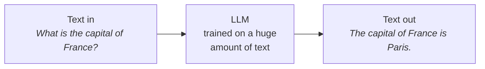

LLM bahut smart hota hai, lekin akele me uski **teen badi limits** hain:

| Limit | Iska matlab | Example |
|---|---|---|
| **Frozen knowledge** | Use sirf wahi pata hai jo training ke time seekha tha | Use aaj ka weather ya aaj ki news nahi pata |
| **Cannot act** | Wo sirf text likh sakta hai. Click, save, send ya search nahi kar sakta | Wo aapke liye note save nahi kar sakta, ticket book nahi kar sakta |
| **One shot** | Ek baar jawab deke ruk jaata hai. Apna kaam check nahi karta, dobara try nahi karta | 5 step wale kaam me sab kuch ek hi baar me guess kar deta hai |

**AI agent** in teeno limits ko hata deta hai.

---

## 2. LLM vs Chatbot vs AI Agent

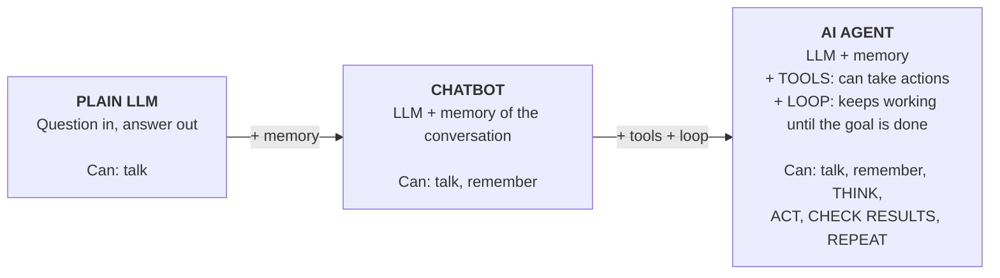

Ek line me farq:

> Chatbot aapko **batata hai** ki kaam kaise karna hai. Agent wo kaam **aapke liye kar deta hai**.

| Aap poochte ho... | Plain LLM / Chatbot | AI Agent |
|---|---|---|
| "What is the weather in Delhi?" | "Mere paas live data nahi hai." | Weather API call karta hai, phir: "Delhi me 33°C hai." |
| "Save this as a note." | "Note aise save kar sakte ho..." | Sach me note ko file me likh deta hai. |
| "Compare the temperature of Delhi and Mumbai." | Numbers guess karta hai | Dono temperature laata hai, difference calculate karta hai, jawab deta hai. |

**Ye definition yaad rakho:**

> **AI agent** ek aisa program hai jisme **LLM** ko ek **goal** milta hai, wo khud **steps decide karta hai**, kaam karne ke liye **tools** use karta hai, aur ek **loop** me tab tak kaam karta rehta hai jab tak goal poora na ho jaye.

---

## 3. A Real-Life Example

AI agent ko ek **smart personal assistant** samjho jo desk pe baitha hai.

Aap bolte ho: *"Friday ke liye Mumbai ki sabse sasti flight book kar do."*

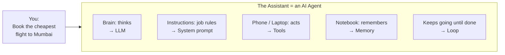

Assistant kya karta hai:

```text
  1. THINK   "Mujhe Friday ki flights ke options chahiye."
  2. ACT     Airline website kholta hai aur search karta hai   (tool: search_flights)
  3. OBSERVE 5 flights dikhti hain. Sabse sasti Rs 4,200 ki.
  4. THINK   "Pehle user ka calendar check kar leta hoon."
  5. ACT     Aapka calendar check karta hai                   (tool: read_calendar)
  6. OBSERVE Aapki 2 PM tak meeting hai.
  7. THINK   "2 PM ke baad wali sabse sasti flight Rs 4,800 ki hai."
  8. ACT     Wo flight book karta hai                         (tool: book_flight)
  9. DONE    "4:30 PM ki flight Rs 4,800 me book kar di. Aapki 2 baje tak meeting hai."
```

Assistant ko kisi ne fixed script nahi di thi. Usne har agla step is basis pe **decide kiya** ki pichhle step me usne kya **dekha**. AI agent bilkul aise hi kaam karta hai.

---

## 4. The 5 Parts of Every AI Agent

Har AI agent, chhoti script se lekar Claude Code ya Cursor tak, inhi paanch parts se bana hota hai.

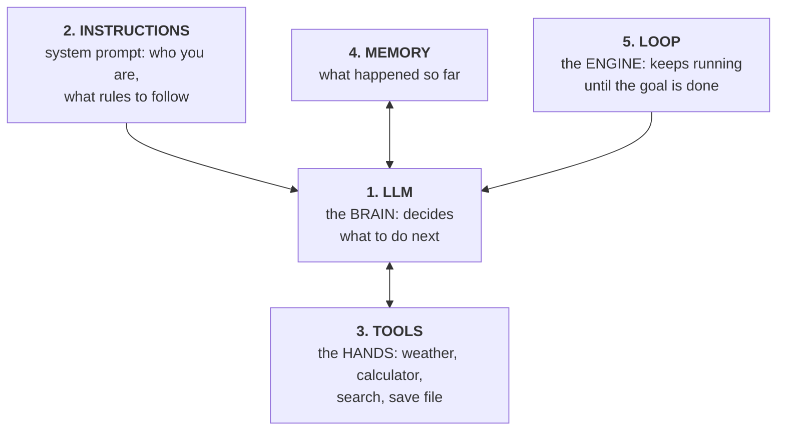

| # | Part | Simple matlab | Hamare project me |
|---|---|---|---|
| 1 | **LLM** | Dimaag. Sab kuch padhta hai aur agla step decide karta hai: tool use karna hai, ya final answer dena hai. | Ollama me `qwen2.5:7b` (ya Gemini / Groq) |
| 2 | **Instructions** | Job description. Agent ko batata hai ki wo kaun hai aur kaunse rules follow karne hain. | `step3_agent.py` me `SYSTEM_PROMPT` |
| 3 | **Tools** | Haath. Normal functions jo data laate hain ya koi action karte hain. | `tools.py`: `get_weather`, `calculator`, `get_time`, `save_note` |
| 4 | **Memory** | Notebook. Ab tak jo hua sab likha rehta hai, taaki agent kuch repeat na kare. | `history` list |
| 5 | **Loop** | Engine. LLM ko call karta hai, tools chalata hai, result wapas bhejta hai, repeat karta hai. | `step3_agent.py` me `run_agent()` |

---

## 5. The Agent Loop: Think, Act, Observe

Ye loop har agent ka dil hai.

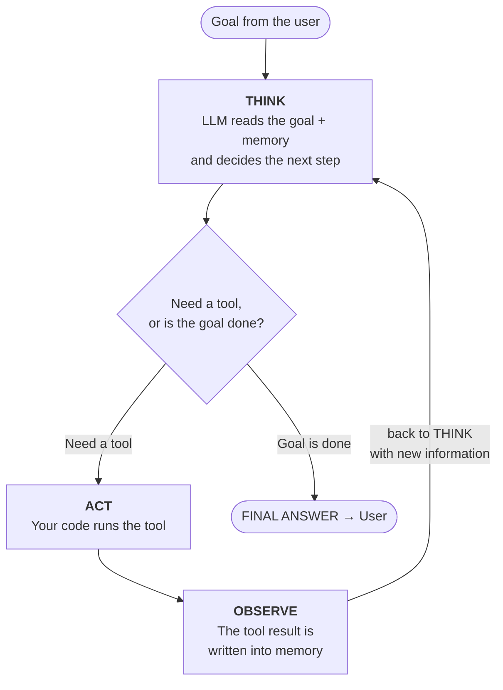

Step by step:

1. User ek **goal** deta hai.
2. Loop goal + instructions + memory + tool list ko **LLM** ke paas bhejta hai.
3. LLM **sochta hai** aur jawab me **ya to** "ye tool call karo" bolta hai, **ya** "ye raha final answer".
4. Agar usne tool maanga, to **aapka code tool chalata hai** (LLM khud code nahi chala sakta).
5. Tool ka result (jise **observation** kehte hain) memory me add ho jaata hai.
6. Wapas step 2 pe jao. Ab LLM ko zyada pata hai, wo phir se decide karta hai.
7. Jab LLM final answer de deta hai, loop ruk jaata hai.

> **Safety rule:** loop pe hamesha **maximum steps ki limit** lagao. Warna confuse hua model hamesha ke liye loop me ghoomta reh sakta hai. Hamara code `MAX_STEPS = 6` use karta hai.

---

## 6. Tool Calling: The Most Important Idea

Zyada tar beginners yahi galat samajhte hain, isliye ise do baar padho:

> **LLM kabhi tool nahi chalata.** Wo sirf ek chhota, structured message likhta hai jo kehta hai *"please `get_weather` ko `city = Delhi` ke saath call karo"*. **Aapka code** asli function chalata hai aur result wapas deta hai.

LLM ko kaise pata chalta hai ki kaunse tools hain? Aap use har tool ka ek **description** bhejte ho (naam, wo kya karta hai, use kya input chahiye). LLM sirf ye description padhta hai. Wo aapka Python code kabhi nahi dekhta.

Ek sawaal ki poori baatcheet neeche **sequence diagram** me hai (upar se neeche padho):

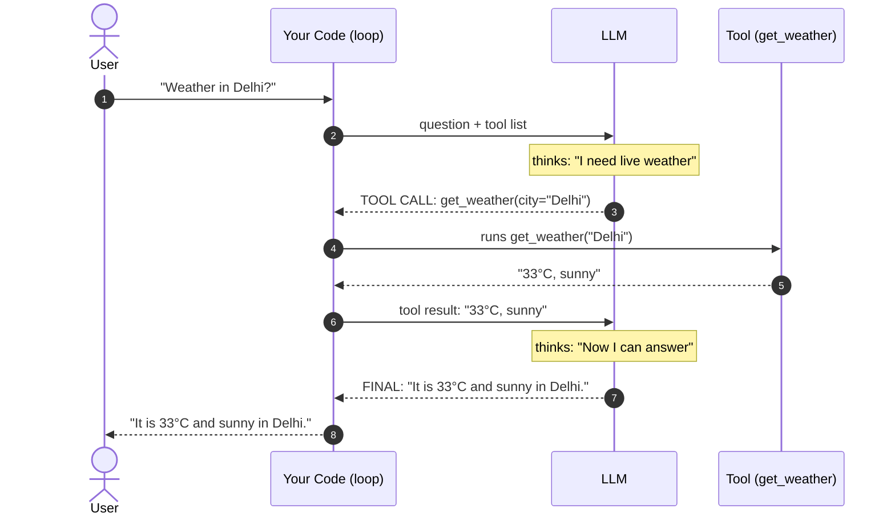

**Tool call kaisa dikhta hai** (LLM asal me ye wapas bhejta hai):

```json
{
  "role": "assistant",
  "content": null,
  "tool_calls": [
    {
      "id": "call_1",
      "type": "function",
      "function": { "name": "get_weather", "arguments": "{\"city\": \"Delhi\"}" }
    }
  ]
}
```

**Tool description kaisa dikhta hai** (ye hum LLM ko bhejte hain):

```json
{
  "type": "function",
  "function": {
    "name": "get_weather",
    "description": "Gets the current (live) weather of a city",
    "parameters": {
      "type": "object",
      "properties": { "city": { "type": "string" } },
      "required": ["city"]
    }
  }
}
```

Inputs describe karne ke is format ko **JSON Schema** kehte hain. Ye bas ek standard tarika hai ye kehne ka ki "is tool ko `city` naam ka ek text field chahiye".

Ab aap theory samajh gaye. Chalo ek agent banate hain.

---
---

# PART 2: BUILD YOUR AGENT

---

## 7. What You Will Build

Ek terminal chat agent jo aise kaam karta hai:

```text
You: What is the temperature difference between Delhi and Mumbai?
   [Step 1] Tool: get_weather({'city': 'Delhi'})
   [Step 1] Result: Delhi: 33.1°C, humidity 52%, wind 9.4 km/h
   [Step 1] Tool: get_weather({'city': 'Mumbai'})
   [Step 1] Result: Mumbai: 28.4°C, humidity 81%, wind 14.2 km/h
   [Step 2] Tool: calculator({'expression': '33.1 - 28.4'})
   [Step 2] Result: 4.7
Agent: Delhi is about 4.7°C warmer than Mumbai right now.
```

Agent ko kisi ne nahi bataya ki kaunse tools use karne hain ya kis order me. Usne khud **decide kiya** ki pehle do baar weather laana hai, phir calculator use karna hai, phir jawab dena hai.

### How the project fits together

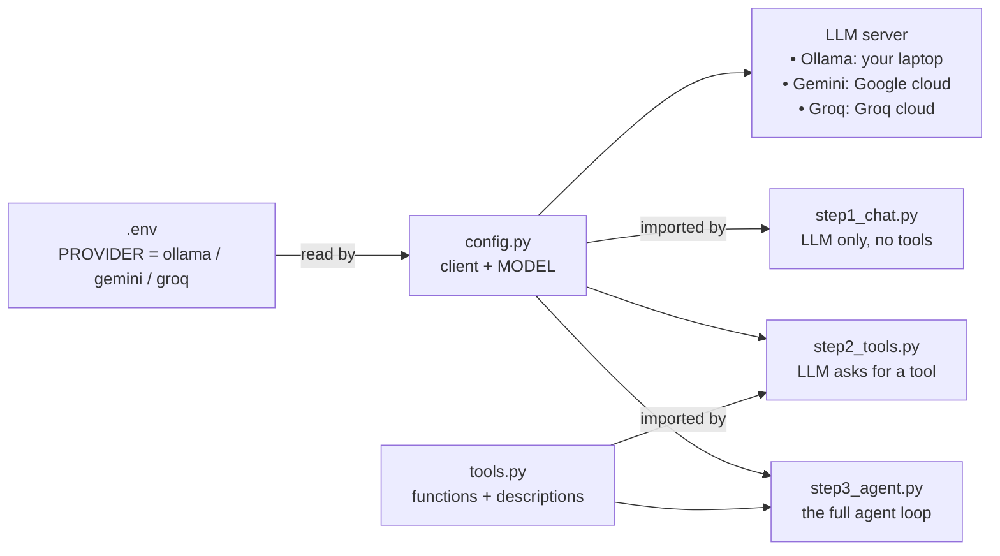

### Final folder structure

```text
AgentDemo/
├── .env              # your settings (provider, API keys) - never share this
├── .env.example      # template for .env
├── .gitignore        # keeps .env and venv out of Git
├── requirements.txt  # Python packages
├── config.py         # picks the model (Ollama / Gemini / Groq)
├── tools.py          # the agent's tools (plain Python functions)
├── step1_chat.py     # plain LLM call
├── step2_tools.py    # model asks for a tool
└── step3_agent.py    # the full AI agent
```

### Every file explained: what it is and why we need it

Code likhne se pehle, project ki **har file aur folder** simple shabdon me samajh lo. Project ko ek **restaurant ki kitchen** samjho:

```text
 ┌───────────────────────────── THE KITCHEN (AgentDemo/) ─────────────────────────────┐
 │                                                                                    │
 │  requirements.txt  = shopping list (kaunse ingredients/packages khareedne hain)    │
 │  venv/             = pantry, jahan khareede hue ingredients rakhe jaate hain       │
 │  .env              = secret keys wala locker (sirf aapke liye)                     │
 │  .env.example      = khaali locker ka label, jo batata hai andar kya jaata hai     │
 │  .gitignore        = "ye cheezein kitchen se bahar mat le jaana" wali list         │
 │  config.py         = aaj kaunsa CHEF (model) kaam karega, ye chunna                │
 │  tools.py          = kitchen ka saaman (chaaku, oven, weighing scale)              │
 │  step1_chat.py     = bina saaman ka chef: sirf khane ki baatein kar sakta hai      │
 │  step2_tools.py    = chef oven MAANGTA hai, lekin dish poori nahi karta            │
 │  step3_agent.py    = chef baar baar saaman use karta hai jab tak dish ready na ho  │
 │                                                                                    │
 └────────────────────────────────────────────────────────────────────────────────────┘
```

| File / folder | Ye kya hai | Iski zarurat kyun hai | Kaun banata hai |
|---|---|---|---|
| `requirements.txt` | Python packages ki ek simple text list | Taaki koi bhi ek command se bilkul same packages install kar sake | Aap |
| `venv/` | Ek folder jisme Python + packages ki private copy hoti hai | Is project ke packages ko baaki projects se alag rakhta hai | `python3 -m venv venv` |
| `.env` | Aapki personal settings: provider ka naam, API keys | Secrets kabhi code ke andar nahi likhne chahiye | Aap (`.env.example` ki copy) |
| `.env.example` | `.env` jaisa hi, lekin keys khaali | Dusron ko dikhata hai ki kaunsi settings hain, bina aapki keys leak kiye | Aap |
| `.gitignore` | Un files ki list jinhe Git ignore kare | `.env` (keys) aur `venv/` (bahut bada) ko GitHub pe upload hone se rokta hai | Aap |
| `config.py` | Python code jo chune hue LLM se connect karta hai | Ollama, Gemini aur Groq ke beech switch karne ki ek hi jagah | Aap |
| `tools.py` | Wo functions jo agent use kar sakta hai, aur unke descriptions | Tools agent ke "haath" hain | Aap |
| `step1_chat.py` | LLM ko ek sawaal bhejta hai, bina tools ke | Plain LLM ki **limits** dikhata hai | Aap |
| `step2_tools.py` | Sawaal **tools ke saath** bhejta hai, tool ek baar chalata hai | Dikhata hai ki LLM sirf tool **maangta** hai, chalata aapka code hai | Aap |
| `step3_agent.py` | Poora agent: loop + memory + tools | Yahi **asli AI agent** hai | Aap |
| `__pycache__/` | Aapki `.py` files ki auto-generated, compiled copies | Python ise agli baar jaldi start hone ke liye banata hai. Ise ignore karo. | Python (automatic) |
| `notes.txt` | `save_note` tool ke save kiye hue notes | Saboot ki agent ne sach me kuch **kiya** | Agent (chalte waqt) |

**Poora code ek badi file me likhne ki jagah kai files me kyun baanta?**

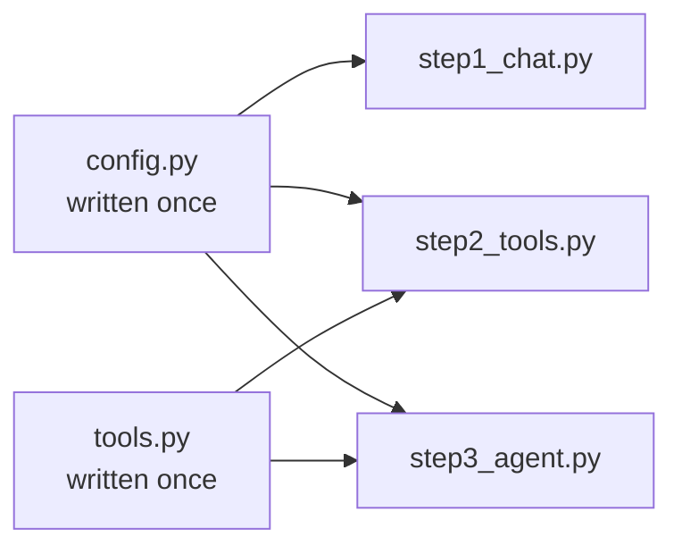

- `config.py` **ek baar** likha jaata hai aur teeno steps use karte hain. Model ek jagah badlo, har step naya model use karega.
- `tools.py` **ek baar** likha jaata hai aur step 2 aur step 3 use karte hain. Ek jagah naya tool jodo, agent use kar lega.
- Teen step files ki wajah se aap **ek time pe ek hi idea seekhte ho**: plain LLM → tool request → poora agent.

---

## 8. Prerequisites

| Requirement | Minimum | Recommended |
|---|---|---|
| OS | macOS, Windows 10/11, ya Linux | Apple Silicon (M1-M4) wala macOS |
| RAM | 8 GB | 16 GB ya usse zyada |
| Free disk space | 6 GB | 10 GB |
| Python | 3.9 | 3.10 ya naya |
| Internet | Downloads aur live weather ke liye chahiye | |

Terminal ka basic use aana kaafi hai (commands chalana, folder badalna).

> **Laptop me RAM kam hai?** Local model skip karo aur free cloud model use karo. [Step 5](#17-step-5-switch-to-a-free-cloud-model) dekho.

---

## 9. Install Python

Check karo ki Python pehle se installed hai ya nahi:

```bash
# macOS / Linux
python3 --version

# Windows
python --version
```

Agar `Python 3.9` ya usse upar dikhe, to aap ready ho. Warna install karo:

- **macOS:** [python.org/downloads](https://www.python.org/downloads/) se download karo, ya `brew install python` chalao
- **Windows:** [python.org/downloads](https://www.python.org/downloads/) se download karo. Installer ki pehli screen pe **"Add Python to PATH" tick karna** mat bhoolna.
- **Linux (Ubuntu/Debian):** `sudo apt install python3 python3-venv python3-pip`

> **Windows note:** jahan bhi is guide me `python3` likha hai, waha `python` type karo.

---

## 10. Install Ollama and Download a Model

[Ollama](https://ollama.com) se aap open-source LLMs **apne laptop pe** chala sakte ho. Ye free hai, API key nahi chahiye, aur model download hone ke baad bina internet ke bhi chalta hai.

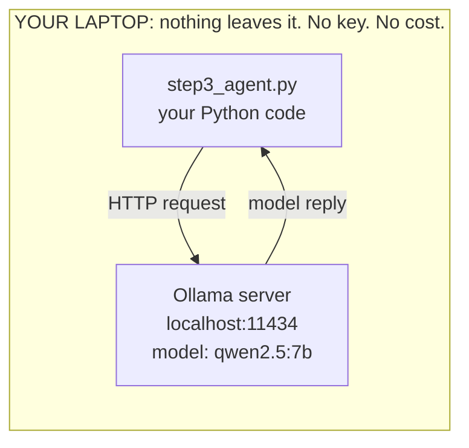

### 10.1 Install Ollama

| OS | Install kaise karein |
|---|---|
| **macOS** | [ollama.com/download](https://ollama.com/download) pe jao, **Download for macOS** pe click karo, file kholo aur **Ollama** ko **Applications** me drag karo. App ek baar kholo; menu bar me llama ka icon aa jayega. |
| **Windows** | [ollama.com/download](https://ollama.com/download) pe jao, Windows installer download karke chalao. |
| **Linux** | `curl -fsSL https://ollama.com/install.sh \| sh` |

Install check karo:

```bash
ollama --version
```

> **Dhyan do:** agar aap sirf `ollama` likhoge (aage kuch nahi), to naye versions ek menu kholte hain jisme Claude Code, OpenCode jaisi integrations launch karne ka option hota hai. **Inme se kisi ki zarurat nahi hai.** Bahar aane ke liye `Esc` dabao. Hamesha poori command likho, jaise `ollama pull ...` ya `ollama run ...`.

### 10.2 Download a model

Har model tools use nahi kar sakta. Hame aisa model chahiye jo **tool calling** (ise function calling bhi kehte hain) support kare. `qwen2.5` ek bharosemand choice hai.

Apne laptop ke hisaab se size chuno:

| Aapki RAM | Command | Download size | Notes |
|---|---|---|---|
| 8 GB | `ollama pull qwen2.5:3b` | ~1.9 GB | Tez hai, kabhi kabhi tool me galti karta hai |
| 16 GB+ | `ollama pull qwen2.5:7b` | ~4.7 GB | **Is guide ke liye recommended** |
| 24 GB+ | `ollama pull qwen2.5:14b` | ~9 GB | Sabse accurate, thoda slow |

> Number (3b, 7b, 14b) model ke **parameters** hain, billions me. Zyada parameters matlab aam taur pe zyada smart, lekin slow aur bada.

```bash
ollama pull qwen2.5:7b
```

Output aisa aana chahiye:

```text
pulling manifest
pulling 2bada8a74506: 100% ▕██████████████████▏ 4.7 GB
verifying sha256 digest
writing manifest
success
```

### 10.3 Test the model

```bash
ollama list
```

```text
NAME          ID              SIZE      MODIFIED
qwen2.5:7b    845dbda0ea48    4.7 GB    2 minutes ago
```

Ek baar model se baat karo:

```bash
ollama run qwen2.5:7b "Hello, introduce yourself in one line"
```

Jawab aa gaya matlab model kaam kar raha hai. (Agar interactive chat khul gayi ho, to bahar aane ke liye `/bye` likho.)

> macOS aur Windows pe Ollama app khulte hi Ollama server apne aap start ho jaata hai. Linux pe agar server nahi chal raha, to ek alag terminal me `ollama serve` chalao.

---

## 11. Create the Project

### Before you start: how to create a file

Is guide me aap kai files banaoge (`requirements.txt`, `.env.example`, `config.py` aur baaki). File banane ke do tarike hain. Koi ek chuno.

**Tarika 1: code editor (sabse aasaan)**

Project folder ko VS Code (ya kisi bhi editor) me kholo:

```bash
code .
```

Phir **New File** pe click karo, file ka exact naam likho (jaise `config.py`), is guide se content paste karo aur **Save** karo (macOS pe `Cmd + S`, Windows/Linux pe `Ctrl + S`).

> Agar `code .` chalane pe `command not found` aaye, to VS Code kholo, `Cmd + Shift + P` dabao, **Shell Command: Install 'code' command in PATH** chalao, phir dobara try karo. Ya seedha VS Code ke **File → Open Folder** menu se folder khol lo.

**Tarika 2: terminal**

Har file ke liye ye guide ek ready-made command deti hai jo sahi content ke saath file bana deti hai. **Poora** command block copy karo aur terminal me paste karo.

Lambi code files ke liye aap ek khaali file bana ke use editor me khol sakte ho:

```bash
# macOS / Linux
touch config.py
open -e config.py        # macOS TextEdit (or: code config.py)

# Windows (PowerShell)
ni config.py
notepad config.py
```

> **Common galti:** file ka *content* (jaise `openai` ya `python-dotenv`) seedha terminal me type **mat** karo. Terminal har line ko command samajhta hai aur `command not found` dikhata hai. File ka content hamesha **file ke andar** jaata hai.

### 11.1 Create a folder

```bash
mkdir AgentDemo
cd AgentDemo
```

| Command | Matlab |
|---|---|
| `mkdir AgentDemo` | **m**a**k**e **dir**ectory: `AgentDemo` naam ka ek naya khaali folder banata hai |
| `cd AgentDemo` | **c**hange **d**irectory: terminal ko us folder ke andar le jaata hai. Ab jo bhi file banaoge, yahin banegi. |

### 11.2 Create a virtual environment

**Virtual environment** (venv) Python packages ka ek private dabba hai, sirf is project ke liye, taaki aapke computer pe baaki kuch kharab na ho.

**Iski zarurat kyun hai?** Maan lo project A ko ek package ka version 1 chahiye aur project B ko version 2. Agar dono ek hi global Python me install karein, to ek na ek toot jayega. venv har project ko uska apna alag dabba deta hai.

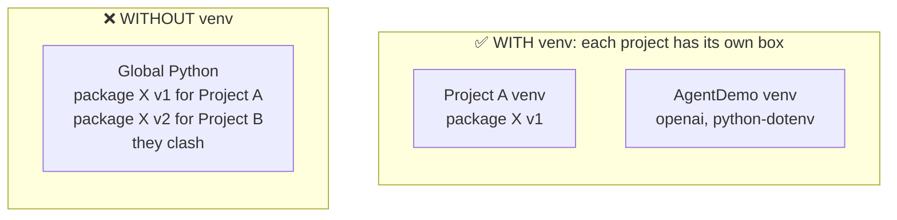

```bash
python3 -m venv venv
```

| Part | Matlab |
|---|---|
| `python3` | Python chalao |
| `-m venv` | Python ka built-in **m**odule `venv` use karo |
| `venv` (aakhri shabd) | Banne wale folder ka naam. Kuch bhi rakh sakte ho, lekin `venv` common naam hai. |

Iske baad ek naya folder `venv/` ban jaata hai. Isme Python aur `pip` ki private copy hoti hai. Iske andar aapko kabhi kuch edit nahi karna.

Ise activate karo:

```bash
# macOS / Linux
source venv/bin/activate

# Windows (Command Prompt)
venv\Scripts\activate

# Windows (PowerShell)
venv\Scripts\Activate.ps1
```

Ab aapka prompt `(venv)` se shuru hona chahiye. venv ke andar `python` aur `pip` har OS pe ek jaise kaam karte hain.

**"Activate" ka matlab kya hai?** Ye terminal ko batata hai: *"ab se jab main `python` ya `pip` likhun, to `venv/` ke andar wali copy use karna, global wali nahi."* Prompt ke shuru me `(venv)` iska sign hai ki venv active hai.

```text
 (venv) user@laptop AgentDemo %  ◄── "(venv)" means the private box is ON
```

> Jab bhi is project ke liye **naya terminal** kholo, folder me `cd` karo aur venv dobara activate karo. Band karne ke liye `deactivate` likho.

### 11.3 Install packages

**`requirements.txt` kya hai?** Ye project ko chahiye Python packages ki ek **shopping list** hai, har line me ek package. Sabko "ye install karo, phir ye, phir ye" bolne ki jagah aap unhe ek file de dete ho.

**`requirements.txt`** naam ki file banao jisme ye do lines hon:

```text
openai
python-dotenv
```

**Terminal se banao:**

```bash
# macOS / Linux
printf "openai\npython-dotenv\n" > requirements.txt

# Windows (PowerShell)
Set-Content requirements.txt "openai","python-dotenv"
```

File check karo:

```bash
cat requirements.txt        # Windows: type requirements.txt
```

Dono package names dikhne chahiye. Agar `Is a directory` error aaye, to galti se `requirements.txt` naam ka **folder** ban gaya hai. Use `rm -rf requirements.txt` se hatao aur upar wali command dobara chalao.

| Package | Ye kya hai | Iski zarurat kyun hai |
|---|---|---|
| `openai` | Chat LLM servers se baat karne ki ek Python library | Ollama, Gemini aur Groq teeno ek hi "OpenAI-compatible" request format samajhte hain, isliye ye **ek** library teeno se baat kar sakti hai. **Hum OpenAI ki paid service use nahi kar rahe**, sirf uski free library. |
| `python-dotenv` | Ek chhoti library jo `.env` file padhti hai | Hamari settings (provider ka naam, API keys) `.env` se Python me laati hai |

Ab inhe install karo:

```bash
pip install -r requirements.txt
```

**Ye command kya karti hai?**

| Part | Matlab |
|---|---|
| `pip` | Python ka package installer (Python libraries ka app store samjho) |
| `install` | Packages download karke install karo |
| `-r requirements.txt` | "is file se packages ki list **r**ead karo" |

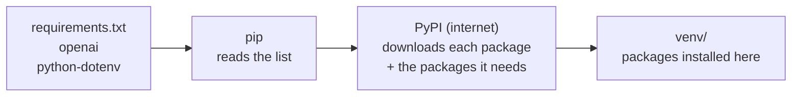

Aapko `Collecting openai...` aur `Successfully installed ...` jaisi bahut saari lines dikhengi. Ye normal hai: `openai` ko kuch helper packages bhi chahiye (jaise `httpx` aur `pydantic`), aur `pip` unhe apne aap install kar deta hai.

Check karo ki install hua:

```bash
pip list
```

List me `openai` aur `python-dotenv` dikhne chahiye.

### 11.4 Create the settings file

**Settings ki alag file kyun?** API keys password jaisi hoti hain. Agar aap unhe `config.py` ke andar likh do aur code share karo ya GitHub pe push karo, to koi bhi unhe chura ke galat use kar sakta hai. Isliye hum **settings aur secrets ko alag file** (`.env`) me rakhte hain, aur **code** sirf usse padhta hai.

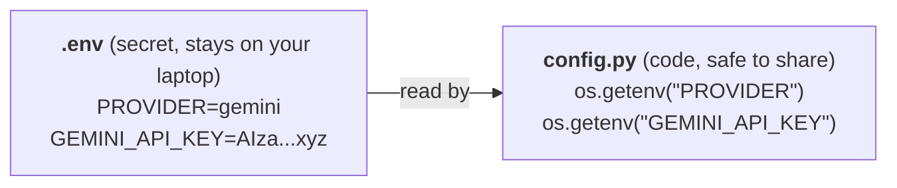

Hum **do** files banate hain:

| File | Isme kya hai | Share karein? |
|---|---|---|
| `.env.example` | Saari settings ke **naam**, keys **khaali** | Haan. Ye dusron ke liye template hai. |
| `.env` | **Wahi** settings, lekin **aapki asli keys** ke saath | **Kabhi nahi** |

**`.env.example`** is content ke saath banao:

```bash
# Copy this file and name the copy .env, then fill in the values
# PROVIDER options: ollama | gemini | groq   (all three are free)
PROVIDER=ollama

# Option 1: Ollama (local, no key needed)
OLLAMA_MODEL=qwen2.5:7b

# Option 2: Gemini free key -> https://aistudio.google.com/apikey
GEMINI_API_KEY=
GEMINI_MODEL=gemini-2.5-flash

# Option 3: Groq free key -> https://console.groq.com/keys
GROQ_API_KEY=
GROQ_MODEL=openai/gpt-oss-20b
```

**Terminal se banao** (poora block copy karo, aakhri `EOF` line ke saath):

```bash
# macOS / Linux
cat > .env.example <<'EOF'
# Copy this file and name the copy .env, then fill in the values
# PROVIDER options: ollama | gemini | groq   (all three are free)
PROVIDER=ollama

# Option 1: Ollama (local, no key needed)
OLLAMA_MODEL=qwen2.5:7b

# Option 2: Gemini free key -> https://aistudio.google.com/apikey
GEMINI_API_KEY=
GEMINI_MODEL=gemini-2.5-flash

# Option 3: Groq free key -> https://console.groq.com/keys
GROQ_API_KEY=
GROQ_MODEL=openai/gpt-oss-20b
EOF
```

```powershell
# Windows (PowerShell)
@'
# Copy this file and name the copy .env, then fill in the values
# PROVIDER options: ollama | gemini | groq   (all three are free)
PROVIDER=ollama

# Option 1: Ollama (local, no key needed)
OLLAMA_MODEL=qwen2.5:7b

# Option 2: Gemini free key -> https://aistudio.google.com/apikey
GEMINI_API_KEY=
GEMINI_MODEL=gemini-2.5-flash

# Option 3: Groq free key -> https://console.groq.com/keys
GROQ_API_KEY=
GROQ_MODEL=openai/gpt-oss-20b
'@ | Set-Content .env.example
```

`cat > .env.example <<'EOF'` ka matlab: *"neeche jo bhi likha hai use `.env.example` me likh do, jab tak `EOF` wali line na aa jaye"*. (`EOF` ka matlab **E**nd **O**f **F**ile.)

**Line by line:**

| Line | Matlab |
|---|---|
| `# ...` | `#` se shuru hone wali lines comments hain. Ye insaano ke liye notes hain, inhe ignore kiya jaata hai. |
| `PROVIDER=ollama` | Kaunsa LLM use karna hai. Baad me `gemini` ya `groq` kar sakte ho. |
| `OLLAMA_MODEL=qwen2.5:7b` | Kaunsa local model use karna hai. Ye `ollama list` me dikhne wale naam se match hona chahiye. |
| `GEMINI_API_KEY=` | Abhi khaali. Step 5 me yahan apni free Gemini key paste karoge. |
| `GEMINI_MODEL=gemini-2.5-flash` | Kaunsa Gemini model use karna hai |
| `GROQ_API_KEY=` | Abhi khaali. Step 5 me yahan apni free Groq key paste karoge. |
| `GROQ_MODEL=openai/gpt-oss-20b` | Kaunsa Groq model use karna hai |

Format hamesha `NAME=value` hota hai, `=` ke aas paas **koi space nahi** aur **quotes ki zarurat nahi**.

Template copy karke apni asli settings file banao:

```bash
# macOS / Linux
cp .env.example .env

# Windows
copy .env.example .env
```

`cp` ka matlab **c**o**p**y: ye `.env.example` jaisa hi content wali nayi file `.env` bana deta hai. Local model ke liye kuch badalne ki zarurat nahi, kyunki `PROVIDER=ollama` pehle se set hai.

> **3b ya 14b model use kar rahe ho?** `.env` me `OLLAMA_MODEL` ko us model ke naam se badal do jo aapne pull kiya.
>
> **Finder ya File Explorer me `.env` nahi dikh rahi?** Dot se shuru hone wali files default me hidden hoti hain. macOS pe Finder me `Cmd + Shift + .` dabao, ya folder VS Code me kholo.

### 11.5 Create .gitignore

**Ye kya hai?** Agar aap project GitHub pe daaloge, to Git **har** file upload kar dega. `.gitignore` un files aur folders ki list hai jinhe Git ko **skip** karna hai.

**`.gitignore`** is content ke saath banao:

```text
venv/
.env
__pycache__/
notes.txt
```

**Terminal se banao:**

```bash
# macOS / Linux
printf "venv/\n.env\n__pycache__/\nnotes.txt\n" > .gitignore

# Windows (PowerShell)
Set-Content .gitignore "venv/",".env","__pycache__/","notes.txt"
```

| Line | Ise skip kyun karte hain |
|---|---|
| `venv/` | Bahut bada hai, aur koi bhi `pip install -r requirements.txt` se dobara bana sakta hai |
| `.env` | Isme aapki secret API keys hain |
| `__pycache__/` | Python apne aap banata hai, zarurat nahi |
| `notes.txt` | Agent chalte waqt jo personal notes banata hai |

Agar aap Git use hi nahi karte, to bhi is file se koi nuksaan nahi. Ye ek achhi aadat hai.

---

## 12. Step 0: config.py (Choose Your Model)

Ye file **ek client object** banati hai jise baaki poora project use karta hai.

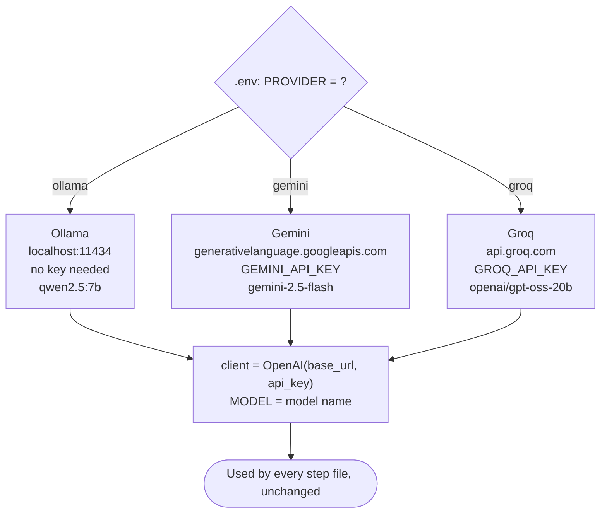

Provider badalne pe sirf teen cheezein badalti hain: server ka address (`base_url`), key (`api_key`) aur model ka naam. Agent ka code kabhi nahi badalta.

**`config.py`** banao aur neeche ka code usme paste karo:

```bash
touch config.py         # Windows (PowerShell): ni config.py
```

Phir use editor me kholo (`code config.py`), code paste karo aur save karo.

```python
"""
config.py - Decides which LLM (model) the project uses.

All three options are FREE:
  1. ollama -> A local model running on your laptop (no internet or API key needed)
  2. gemini -> Google AI Studio free API key (aistudio.google.com)
  3. groq   -> Groq free API key (console.groq.com), very fast

All three offer an "OpenAI-compatible" API, so the code stays the same.
Only the base_url, api_key and model name change.
"""
import os
from openai import OpenAI

try:
    from dotenv import load_dotenv
    load_dotenv()          # Load settings from the .env file
except ImportError:
    pass

PROVIDER = os.getenv("PROVIDER", "ollama").lower()

PROVIDERS = {
    "ollama": {
        "base_url": "http://localhost:11434/v1",
        "api_key": "ollama",                                   # dummy value, Ollama does not need a key
        "model": os.getenv("OLLAMA_MODEL", "qwen2.5:7b"),
    },
    "gemini": {
        "base_url": "https://generativelanguage.googleapis.com/v1beta/openai/",
        "api_key": os.getenv("GEMINI_API_KEY"),
        "model": os.getenv("GEMINI_MODEL", "gemini-2.5-flash"),
    },
    "groq": {
        "base_url": "https://api.groq.com/openai/v1",
        "api_key": os.getenv("GROQ_API_KEY"),
        "model": os.getenv("GROQ_MODEL", "openai/gpt-oss-20b"),
    },
}

if PROVIDER not in PROVIDERS:
    raise SystemExit(f"Invalid PROVIDER '{PROVIDER}'. Use one of: ollama | gemini | groq")

_cfg = PROVIDERS[PROVIDER]
if not _cfg["api_key"]:
    raise SystemExit(f"{PROVIDER.upper()}_API_KEY is missing. Add it to your .env file.")

client = OpenAI(base_url=_cfg["base_url"], api_key=_cfg["api_key"])
MODEL = _cfg["model"]

print(f"[Config] Provider: {PROVIDER} | Model: {MODEL}")
```

### Code walkthrough: config.py

**Ye file kyun hai:** har step file ko LLM se baat karni hai. Connection ka code teen baar likhne ki jagah hum use yahan **ek baar** likhte hain. Baaki files bas `from config import client, MODEL` likhti hain.

**Part 1: Imports**

```python
import os
from openai import OpenAI
```

- `os` Python ka built-in module hai. Settings padhne ke liye hum `os.getenv(...)` use karte hain.
- `OpenAI` `openai` package ki client class hai. **Client** ek object hai jise pata hai ki LLM server ko request kaise bhejni hai aur jawab kaise padhna hai.

**Part 2: `.env` file load karo**

```python
try:
    from dotenv import load_dotenv
    load_dotenv()
except ImportError:
    pass
```

- `load_dotenv()` `.env` kholta hai aur har `NAME=value` line ko `os.getenv("NAME")` se padhne layak bana deta hai.
- `try / except ImportError` ka matlab: agar `python-dotenv` install nahi hai, to crash mat karo, bas aage badho.

**Part 3: Kaunsa provider use karna hai, ye padho**

```python
PROVIDER = os.getenv("PROVIDER", "ollama").lower()
```

- `.env` se `PROVIDER` padhta hai. Agar missing hai, to default `"ollama"` hai.
- `.lower()` `Gemini` ya `GEMINI` ko `gemini` bana deta hai, taaki capital letters se error na aaye.

**Part 4: Provider table**

```python
PROVIDERS = {
    "ollama": { "base_url": ..., "api_key": ..., "model": ... },
    "gemini": { ... },
    "groq":   { ... },
}
```

Ye Python ki ek **dictionary** hai, yaani ek lookup table. Har provider ke liye ye teen cheezein rakhti hai:

| Key | Matlab | Ollama example |
|---|---|---|
| `base_url` | LLM server ka address | `http://localhost:11434/v1` (aapka apna laptop) |
| `api_key` | Us server ka password | `"ollama"` (dummy value; Ollama ise check nahi karta) |
| `model` | Us server pe kaunsa model use karna hai | `qwen2.5:7b` |

`os.getenv("OLLAMA_MODEL", "qwen2.5:7b")` dekho: `.env` se padho, aur agar missing ho to comma ke baad wala default use karo.

**Part 5: Safety checks**

```python
if PROVIDER not in PROVIDERS:
    raise SystemExit(...)

_cfg = PROVIDERS[PROVIDER]
if not _cfg["api_key"]:
    raise SystemExit(...)
```

- Agar aapne provider ka naam galat likha (jaise `gemni`), to program baad me confusing error dene ki jagah turant ek clear message ke saath ruk jaata hai.
- `_cfg` table me se chune hue provider ki settings uthata hai.
- Agar aapne Gemini ya Groq chuna lekin key daalna bhool gaye, to program exactly batata hai ki kya missing hai.

**Part 6: Client banao**

```python
client = OpenAI(base_url=_cfg["base_url"], api_key=_cfg["api_key"])
MODEL = _cfg["model"]
print(f"[Config] Provider: {PROVIDER} | Model: {MODEL}")
```

- `client` wo object hai jisse hum baad me messages bhejte hain: `client.chat.completions.create(...)`.
- `MODEL` model ka naam hai jo har request ke saath jaata hai.
- `print` wali line har step chalate waqt dikhati hai ki kaunsa provider active hai, taaki aap kabhi confuse na ho.

> **Main idea:** `openai` library ko farq nahi padta ki `base_url` ke peeche *kaun* hai. Use Ollama, Gemini ya Groq ki taraf point karo, same code chalega. Isi wajah se model badalne pe agent ka code kabhi nahi badalta.

Ye file aap seedha nahi chalaoge. Agle steps ise import karte hain.

---

## 13. Step 1: Talk to the LLM (Not an Agent Yet)

Agent banane se pehle dekho ki plain LLM kya kar sakta hai aur kya nahi.

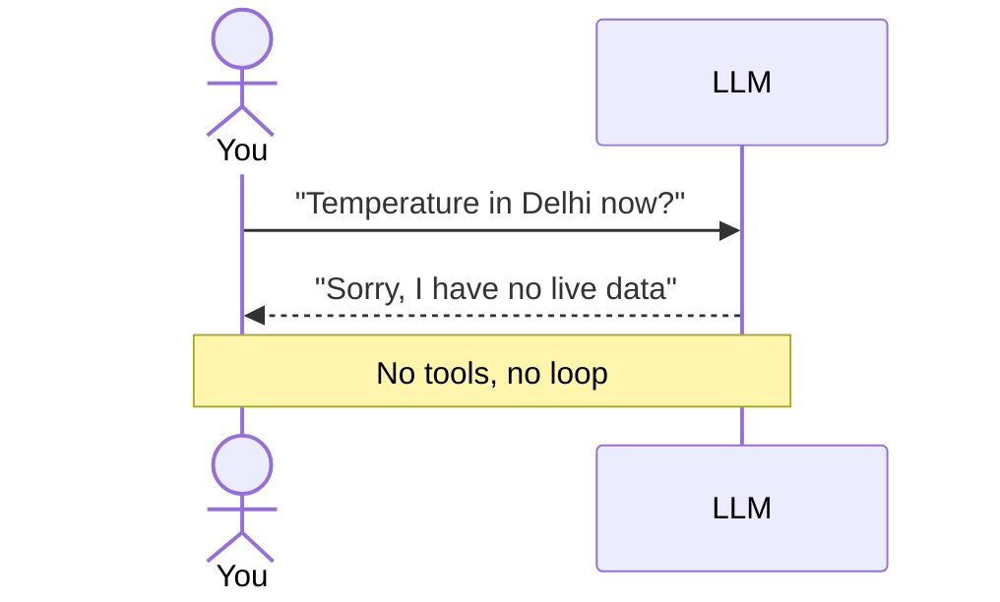

**`step1_chat.py`** banao aur neeche ka code usme paste karo:

```bash
touch step1_chat.py         # Windows (PowerShell): ni step1_chat.py
```

Phir use editor me kholo (`code step1_chat.py`), code paste karo aur save karo.

```python
"""
STEP 1 - Just the LLM (this is NOT an agent yet)

Lesson: The model can only generate text. It has no real-time data
(today's weather, the current time) and it cannot take any action.
"""
from config import client, MODEL

question = "What is the temperature in Delhi right now?"
print("You:", question)

response = client.chat.completions.create(
    model=MODEL,
    messages=[{"role": "user", "content": question}],
)

print("LLM:", response.choices[0].message.content)
print("\n>> Notice: the model has no live data. It will either refuse or guess.")
print(">> To fix this, we must give the model TOOLS -> step2_tools.py")
```

### Code walkthrough: step1_chat.py

**Ye file kyun hai:** apni aankhon se dekhne ke liye ki plain LLM kya **nahi** kar sakta. Ye "pehle" ki tasveer hai; agent "baad" ki.

**Upar `"""` quotes me likha text** ek **docstring** hai, yaani insaano ke liye note. Python ise ignore karta hai.

```python
from config import client, MODEL
```

`config.py` se ready-made `client` aur `MODEL` laata hai. Ye line `config.py` ko chalati bhi hai, jo `[Config] Provider: ...` print karta hai.

```python
question = "What is the temperature in Delhi right now?"
print("You:", question)
```

Jo sawaal poochna hai wo, aur use print karte hain taaki screen pe dikhe.

```python
response = client.chat.completions.create(
    model=MODEL,
    messages=[{"role": "user", "content": question}],
)
```

Ye hai **LLM ko call**. Ise samajhna sabse zaroori hai, kyunki har step isi ko use karta hai.

| Part | Matlab |
|---|---|
| `client.chat.completions.create(...)` | "LLM ko chat bhejo aur uske jawab ka wait karo" |
| `model=MODEL` | Kaunsa model jawab dega (jaise `qwen2.5:7b`) |
| `messages=[...]` | Ab tak ki baatcheet, messages ki ek **list** ke roop me |
| `{"role": "user", "content": question}` | Ek message. `role` batata hai **kaun** bol raha hai, `content` batata hai **kya** bola. |

Is project me aapko ye roles dikhenge:

| Role | Kaun bol raha hai |
|---|---|
| `system` | Model ke liye hidden instructions (step 3 me use hota hai) |
| `user` | Aap, yaani insaan |
| `assistant` | Model |
| `tool` | Hamare code ne jo tool chalaya uska result (step 3 me use hota hai) |

```python
print("LLM:", response.choices[0].message.content)
```

Jawab ek object ke roop me aata hai. `response.choices[0]` pehla (aur akela) jawab hai, `.message` uske andar ka message hai, aur `.content` uska text.

```text
 response
  └── choices           (a list of replies; we asked for one)
       └── [0]
            └── message
                 ├── role:       "assistant"
                 ├── content:    "I don't have access to real-time data..."
                 └── tool_calls: None   (no tools were given, so none requested)
```

Aakhri do `print` lines bas audience ke liye notes hain.

Chalao:

```bash
python step1_chat.py
```

Example output (aapka thoda alag ho sakta hai):

```text
[Config] Provider: ollama | Model: qwen2.5:7b
You: What is the temperature in Delhi right now?
LLM: I don't have access to real-time data. For the current temperature in Delhi,
please check a weather website or app...
```

**Seekh:** Model smart hai lekin **waqt me jama hua** hai. Uske paas live data nahi hai aur wo file save karne jaise action nahi le sakta. Wo ya to mana karta hai ya guess karta hai. Isko hum **tools** se theek karenge.

> **Try karo:** `question` ko `"Explain an AI agent in one line"` kar do. General knowledge ke liye plain LLM theek hai.

---

## 14. Step 2: Give the Model Tools

**Tool** bas ek normal Python function hai. Model use use kar sake, iske liye do cheezein chahiye:

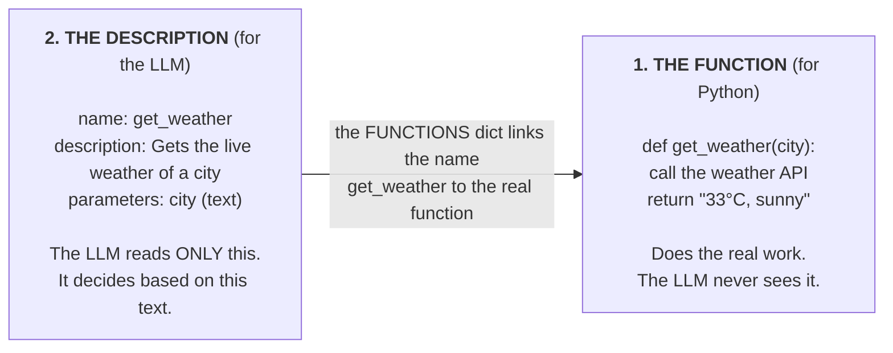

**`tools.py`** banao aur neeche ka code usme paste karo:

```bash
touch tools.py         # Windows (PowerShell): ni tools.py
```

Phir use editor me kholo (`code tools.py`), code paste karo aur save karo.

```python
"""
tools.py - The agent's "hands". These are just normal Python functions.

get_weather -> Live weather from the FREE Open-Meteo API (no key needed)
calculator  -> Solves a math expression
get_time    -> Returns the current date and time
save_note   -> Writes a note to notes.txt (shows the agent can take ACTIONS)
"""
import datetime
import json
import urllib.parse
import urllib.request


def _get_json(url):
    with urllib.request.urlopen(url, timeout=10) as r:
        return json.loads(r.read().decode())


def get_weather(city: str) -> str:
    try:
        q = urllib.parse.quote(city)
        geo = _get_json(f"https://geocoding-api.open-meteo.com/v1/search?name={q}&count=1")
        if not geo.get("results"):
            return f"Could not find a city named '{city}'"
        place = geo["results"][0]
        lat, lon = place["latitude"], place["longitude"]
        data = _get_json(
            "https://api.open-meteo.com/v1/forecast"
            f"?latitude={lat}&longitude={lon}&current=temperature_2m,relative_humidity_2m,wind_speed_10m"
        )
        c = data["current"]
        return (f"{place['name']}: {c['temperature_2m']}°C, "
                f"humidity {c['relative_humidity_2m']}%, wind {c['wind_speed_10m']} km/h")
    except Exception:
        # If the internet fails during a workshop, the demo should not stop
        fake = {"delhi": "34°C, sunny", "mumbai": "29°C, rainy", "bangalore": "24°C, cloudy"}
        return fake.get(city.lower(), "25°C, clear sky") + " (offline sample data)"


def calculator(expression: str) -> str:
    try:
        # For demo purposes only. Never use eval() in production code.
        return str(eval(expression, {"__builtins__": {}}, {}))
    except Exception as e:
        return f"Error: {e}"


def get_time() -> str:
    return datetime.datetime.now().strftime("%d %b %Y, %I:%M %p")


def save_note(text: str) -> str:
    with open("notes.txt", "a", encoding="utf-8") as f:
        f.write(f"[{get_time()}] {text}\n")
    return "Note saved to notes.txt"


# Name -> function mapping (the model says a tool name, we run the matching function)
FUNCTIONS = {
    "get_weather": get_weather,
    "calculator": calculator,
    "get_time": get_time,
    "save_note": save_note,
}

# We must tell the model which tools exist and what inputs they need (JSON Schema)
TOOLS = [
    {
        "type": "function",
        "function": {
            "name": "get_weather",
            "description": "Gets the current (live) weather of a city",
            "parameters": {
                "type": "object",
                "properties": {"city": {"type": "string", "description": "City name, e.g. Delhi"}},
                "required": ["city"],
            },
        },
    },
    {
        "type": "function",
        "function": {
            "name": "calculator",
            "description": "Solves a math expression, e.g. '34 - 29' or '(120*3)/4'",
            "parameters": {
                "type": "object",
                "properties": {"expression": {"type": "string"}},
                "required": ["expression"],
            },
        },
    },
    {
        "type": "function",
        "function": {
            "name": "get_time",
            "description": "Returns the current date and time",
            "parameters": {"type": "object", "properties": {}},
        },
    },
    {
        "type": "function",
        "function": {
            "name": "save_note",
            "description": "Saves a note or reminder for the user to a file",
            "parameters": {
                "type": "object",
                "properties": {"text": {"type": "string"}},
                "required": ["text"],
            },
        },
    },
]
```

### Code walkthrough: tools.py

**Ye file kyun hai:** agent utna hi kaam ka hai jitne uske tools. Ye file **saare** tools ek jagah rakhti hai, taaki step 2 aur step 3 dono unhe use kar sakein. File ke teen sections hain:

```text
 tools.py
 ├── Section A: the functions        get_weather, calculator, get_time, save_note
 ├── Section B: FUNCTIONS            name (text) → real Python function
 └── Section C: TOOLS                descriptions the LLM reads
```

**Section A: functions**

**Imports:**

```python
import datetime, json, urllib.parse, urllib.request
```

Ye chaaron **Python me built-in** hain, isliye kuch extra install nahi karna. `datetime` time deta hai, `json` API ke jawab padhta hai, aur `urllib` web requests bhejta hai.

**`_get_json(url)`: ek chhota helper**

```python
def _get_json(url):
    with urllib.request.urlopen(url, timeout=10) as r:
        return json.loads(r.read().decode())
```

Ek web address kholta hai, zyada se zyada 10 second wait karta hai, aur JSON jawab ko Python dictionary me badal deta hai. Naam ke shuru me `_` ek convention hai jiska matlab hai "andar ka helper, tool nahi".

**`get_weather(city)`: do API calls me live weather**

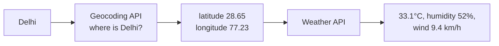

1. Weather API ko city ka naam nahi, coordinates chahiye. Isliye pehle hum Open-Meteo ki **geocoding** API se poochte hain: *"Delhi kahan hai?"*
2. Agar city nahi mili, to ek friendly message return karte hain (LLM use padh ke user ko bata dega).
3. Phir un coordinates ke liye **forecast** API se current temperature, humidity aur wind poochte hain.
4. Hum **ek chhota sentence** return karte hain. Tools ko chhota aur clear text return karna chahiye, kyunki LLM ko use padhna hota hai.

Poore code ke around `try / except` ek **safety net** hai: agar demo ke waqt internet chala jaye, to crash hone ki jagah ye `(offline sample data)` wala sample data return karta hai.

**`calculator(expression)`**

```python
return str(eval(expression, {"__builtins__": {}}, {}))
```

`eval("34 - 29")` text ko Python expression ki tarah chalata hai aur `5` deta hai. `{"__builtins__": {}}` wala hissa khatarnaak built-in functions tak pahunch rokta hai. Phir bhi ye **real apps ke liye safe nahi hai**, lekin demo ke liye theek hai. Hum **string** return karte hain kyunki tool ka result hamesha text ke roop me LLM ke paas jaata hai.

**`get_time()`**

Current date aur time readable text me return karta hai, jaise `30 Sep 2026, 11:45 AM`. LLMs ko current time nahi pata hota, isliye ye kaam ka tool hai.

**`save_note(text)`**

```python
with open("notes.txt", "a", encoding="utf-8") as f:
    f.write(f"[{get_time()}] {text}\n")
```

`notes.txt` ko **append** mode me kholta hai (`"a"`: end me jodo, mitao mat), timestamp ke saath note likhta hai, aur confirmation return karta hai. Yahi ek tool hai jo asli duniya me **kuch badalta** hai. Ye dikhata hai ki agent sirf cheezein dhoondhta nahi, **action bhi leta** hai.

**Section B: `FUNCTIONS`**

```python
FUNCTIONS = {"get_weather": get_weather, ...}
```

LLM tool ka naam **text** me bhejta hai, jaise `"get_weather"`. Python ko **asli function** chahiye. Ye dictionary dono ko jodti hai:

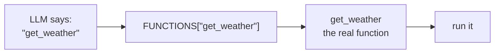

**Section C: `TOOLS`**

Har tool ka ek description, sab ek list me. Har description ka shape same hota hai:

| Field | Matlab |
|---|---|
| `"type": "function"` | Tools ke liye hamesha `function` |
| `"name"` | `FUNCTIONS` ki key se **bilkul same** hona chahiye |
| `"description"` | Simple English me: tool kya karta hai. **LLM ise padh ke hi tool chunta hai.** |
| `"parameters"` | Inputs, JSON Schema format me |
| `"properties"` | Har input ka naam aur type (`string`, `number`, `boolean`...) |
| `"required"` | Kaunse inputs hamesha dene zaroori hain |

`get_time` ki `properties` khaali hain kyunki use koi input nahi chahiye.

**Achhe descriptions likho.** Model sirf `description` aur `parameters` dekh ke tool chunta hai. `"does stuff"` jaisa vague description galat choice karwata hai.

> **Safety note:** `calculator` me `eval()` local demo ke liye theek hai lekin real apps me unsafe hai. Production me proper math parser use karo.

Check karo ki tools akele (bina LLM ke) kaam karte hain:

```bash
python -c "import tools; print(tools.get_weather('Delhi')); print(tools.calculator('12*7')); print(tools.get_time())"
```

---

## 15. Step 3: Let the Model Ask for a Tool

Step 1 wala hi sawaal bhejo, lekin is baar tool list bhi saath bhejo.

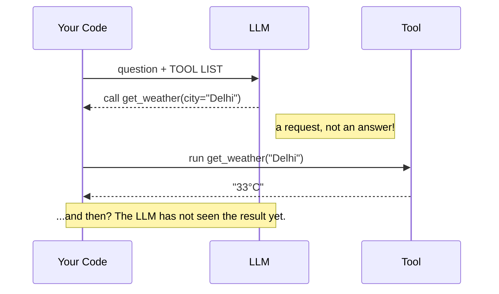

**`step2_tools.py`** banao aur neeche ka code usme paste karo:

```bash
touch step2_tools.py         # Windows (PowerShell): ni step2_tools.py
```

Phir use editor me kholo (`code step2_tools.py`), code paste karo aur save karo.

```python
"""
STEP 2 - Show the tools to the model

Lesson: The model does NOT run the tool itself. It only says
"I need get_weather(city='Delhi')". Our code runs the tool.
"""
import json
from config import client, MODEL
from tools import TOOLS, FUNCTIONS

question = "What is the temperature in Delhi right now?"
print("You:", question)

response = client.chat.completions.create(
    model=MODEL,
    messages=[{"role": "user", "content": question}],
    tools=TOOLS,
)
msg = response.choices[0].message

if msg.tool_calls:
    for tc in msg.tool_calls:
        args = json.loads(tc.function.arguments or "{}")
        print(f"\n>> The model asked for a tool: {tc.function.name}({args})")
        result = FUNCTIONS[tc.function.name](**args)
        print(f">> Our code ran the tool. Result: {result}")
    print("\n>> Next, this result must go back to the model, and we must repeat this")
    print(">> until the model gives a final answer. That is the AGENT LOOP -> step3_agent.py")
else:
    print("The model did not ask for a tool:", msg.content)
```

### Code walkthrough: step2_tools.py

**Ye file kyun hai:** wo **exact moment** dikhane ke liye jab LLM chatbot nahi rehta. Text ki jagah wo **tool use karne ki request** wapas bhejta hai.

```python
import json
from config import client, MODEL
from tools import TOOLS, FUNCTIONS
```

Ab hum `TOOLS` (LLM ke liye descriptions) aur `FUNCTIONS` (Python ke liye asli functions) bhi import karte hain. Tool ke arguments padhne ke liye `json` chahiye.

```python
response = client.chat.completions.create(
    model=MODEL,
    messages=[{"role": "user", "content": question}],
    tools=TOOLS,
)
```

Step 1 jaisi hi call, bas **ek nayi line** ke saath: `tools=TOOLS`. Ye LLM ko batata hai: *"ye tools hain; tum inhe maang sakte ho."*

```python
msg = response.choices[0].message
if msg.tool_calls:
```

Ab jawab do me se ek tarah ka ho sakta hai:

```text
 msg.tool_calls is None       ──►  normal text answer in msg.content
 msg.tool_calls has items     ──►  the LLM wants tools; msg.content is usually empty
```

```python
for tc in msg.tool_calls:
    args = json.loads(tc.function.arguments or "{}")
    result = FUNCTIONS[tc.function.name](**args)
```

Har tool request (`tc`) ke liye:

| Code | Matlab | Example value |
|---|---|---|
| `tc.function.name` | LLM kaunsa tool chahta hai | `"get_weather"` |
| `tc.function.arguments` | Inputs, ek **JSON string** ke roop me | `'{"city": "Delhi"}'` |
| `json.loads(...)` | JSON string ko Python dictionary me badalta hai | `{"city": "Delhi"}` |
| `or "{}"` | Agar koi argument nahi, to khaali dictionary use karo | |
| `FUNCTIONS[...]` | Asli Python function dhoondhta hai | `get_weather` |
| `(**args)` | Dictionary ko named inputs ki tarah pass karta hai | `get_weather(city="Delhi")` |

LLM **ek saath ek se zyada tool** maang sakta hai (jaise do cities ka weather), isliye hum `msg.tool_calls` pe loop chalate hain.

**Kya missing hai?** Humne tool chalaya aur result print kiya, lekin use LLM ko **wapas bheja hi nahi**. Isliye koi final answer nahi aaya. Step 3 ise theek karta hai.

Chalao:

```bash
python step2_tools.py
```

Example output:

```text
[Config] Provider: ollama | Model: qwen2.5:7b
You: What is the temperature in Delhi right now?

>> The model asked for a tool: get_weather({'city': 'Delhi'})
>> Our code ran the tool. Result: Delhi: 33.1°C, humidity 52%, wind 9.4 km/h

>> Next, this result must go back to the model, and we must repeat this
>> until the model gives a final answer. That is the AGENT LOOP -> step3_agent.py
```

**Seekh:** Model ne sawaal ka jawab **nahi** diya. Usne ek **tool call** (`msg.tool_calls`) return kiya: tool ka naam aur arguments. Function hamare code ne chalaya.

Lekin abhi bhi final answer nahi hai, kyunki model ne result dekha hi nahi. Kaam poora karne ke liye hame:

1. Tool ka result model ko wapas bhejna hai.
2. Use dobara decide karne dena hai (shayad use aur tool chahiye).
3. Tab tak repeat karna hai jab tak wo final answer na de.

Yahi repeat karna **agent loop** hai.

---

## 16. Step 4: The Agent Loop (Your First AI Agent)

**`step3_agent.py`** banao aur neeche ka code usme paste karo:

```bash
touch step3_agent.py         # Windows (PowerShell): ni step3_agent.py
```

Phir use editor me kholo (`code step3_agent.py`), code paste karo aur save karo.

```python
"""
STEP 3 - The complete AI Agent

AGENT = LLM (brain) + TOOLS (hands) + LOOP (think -> act -> observe -> think again)

The loop:
  1. Send the messages + tools to the model
  2. If the model asks for a tool -> run it -> add the result to messages -> go to step 1
  3. If the model does not ask for a tool -> that is the final answer
"""
import json
from config import client, MODEL
from tools import TOOLS, FUNCTIONS

SYSTEM_PROMPT = (
    "You are a helpful AI assistant. Use the given tools for live data, "
    "calculations, the current time, or saving notes. Keep answers short and clear."
)
MAX_STEPS = 6   # Safety limit to avoid an infinite loop


def run_agent(user_msg, history):
    history.append({"role": "user", "content": user_msg})

    for step in range(1, MAX_STEPS + 1):
        response = client.chat.completions.create(
            model=MODEL, messages=history, tools=TOOLS
        )
        msg = response.choices[0].message

        # No tool needed -> this is the final answer
        if not msg.tool_calls:
            history.append({"role": "assistant", "content": msg.content})
            return msg.content

        # Save the model's tool request in the history
        history.append({
            "role": "assistant",
            "content": msg.content or "",
            "tool_calls": [tc.model_dump() for tc in msg.tool_calls],
        })

        # Run every requested tool and send the result back
        for tc in msg.tool_calls:
            name = tc.function.name
            args = json.loads(tc.function.arguments or "{}")
            print(f"   [Step {step}] Tool: {name}({args})")
            try:
                result = FUNCTIONS[name](**args)
            except Exception as e:
                result = f"Tool error: {e}"
            print(f"   [Step {step}] Result: {result}")
            history.append({"role": "tool", "tool_call_id": tc.id, "content": str(result)})

    return "Reached the maximum number of steps without a final answer."


if __name__ == "__main__":
    history = [{"role": "system", "content": SYSTEM_PROMPT}]
    print("AI Agent is ready! (type 'exit' to quit)\n")
    print("Try these:")
    print("  - What is the weather in Delhi?")
    print("  - What is the temperature difference between Delhi and Mumbai?")
    print("  - What time is it? Save it as a note.\n")

    while True:
        q = input("You: ").strip()
        if q.lower() in ("exit", "quit"):
            break
        if not q:
            continue
        print("Agent:", run_agent(q, history), "\n")
```

### Code walkthrough: step3_agent.py

**Ye file kyun hai:** yahi **asli AI agent** hai. Isme sab kuch mil jaata hai: LLM (`config.py`), tools (`tools.py`), instructions, memory aur loop. File ke chaar parts hain:

```text
 step3_agent.py
 ├── Part 1: settings        SYSTEM_PROMPT, MAX_STEPS
 ├── Part 2: run_agent()     the agent loop (the brain of the file)
 ├── Part 3: tool handling   run each requested tool, save results
 └── Part 4: chat loop       read your input, call run_agent(), print the answer
```

**Part 1: Settings**

```python
SYSTEM_PROMPT = ("You are a helpful AI assistant. Use the given tools ...")
MAX_STEPS = 6
```

- `SYSTEM_PROMPT` agent ka **job description** hai. Ye sabse pehle `system` role ke saath jaata hai. Ise badlo to agent ka behaviour badal jaata hai (try karo: *"Always answer like a pirate"*).
- `MAX_STEPS` 6 rounds ke baad loop rok deta hai, agar model confuse ho ke hamesha tools call karta rahe.

**Part 2: `run_agent(user_msg, history)`**

```python
def run_agent(user_msg, history):
    history.append({"role": "user", "content": user_msg})
```

- `history` agent ki **memory** hai: ab tak ke har message ki list. Ye shuru me **ek baar** banti hai aur har sawaal ke liye **dobara use** hoti hai, isliye agent pichhle sawaal yaad rakhta hai.
- Sabse pehle aapka naya sawaal memory me jodte hain.

```python
    for step in range(1, MAX_STEPS + 1):
        response = client.chat.completions.create(model=MODEL, messages=history, tools=TOOLS)
        msg = response.choices[0].message
```

- `for step in range(1, MAX_STEPS + 1)` loop ko zyada se zyada 6 baar chalata hai (step = 1, 2, ... 6).
- Har round me **poori history** aur tools bheje jaate hain. Ye **THINK** step hai.

```python
        if not msg.tool_calls:
            history.append({"role": "assistant", "content": msg.content})
            return msg.content
```

- **Koi tool nahi maanga** matlab LLM ke paas final answer hai.
- Hum wo answer memory me save karte hain (taaki follow-up sawaal kaam karein) aur use **return** karte hain. `return` loop ko bhi khatam kar deta hai.

**Part 3: Tool handling**

```python
        history.append({
            "role": "assistant",
            "content": msg.content or "",
            "tool_calls": [tc.model_dump() for tc in msg.tool_calls],
        })
```

- LLM ne tools maange. Hum pehle **uski request** memory me save karte hain. Iske bina LLM baad me tool results dekhega lekin use pata nahi hoga ki usne ye maange the, aur wo confuse ho jayega.
- Ye message hum khud banate hain, sirf un teen fields ke saath jo har provider accept karta hai: `role`, `content` aur `tool_calls`. `tc.model_dump()` har tool request object ko simple dictionary me badal deta hai. (Kuch models, jaise `gpt-oss`, extra fields bhi bhejte hain, jaise apni private reasoning. Poora jawab wapas copy karne se error aa sakta hai, isliye hum sirf zaroori cheezein rakhte hain.)

```python
        for tc in msg.tool_calls:
            name = tc.function.name
            args = json.loads(tc.function.arguments or "{}")
            print(f"   [Step {step}] Tool: {name}({args})")
            try:
                result = FUNCTIONS[name](**args)
            except Exception as e:
                result = f"Tool error: {e}"
            print(f"   [Step {step}] Result: {result}")
            history.append({"role": "tool", "tool_call_id": tc.id, "content": str(result)})
```

Ye **ACT** aur **OBSERVE** step hai:

1. Tool ka naam aur arguments padho (step 2 jaisa).
2. Jo ho raha hai use **print** karo, taaki aap agent ko sochte hue dekh sako. Ye `[Step ...]` lines live demo ka sabse mazedaar hissa hain.
3. Tool ko `try / except` ke andar chalao. Agar tool fail ho jaye, ya LLM koi aisa tool bana de jo hai hi nahi, to hum crash **nahi** karte. Error ko hi result bana ke wapas bhejte hain, aur LLM kuch aur try kar sakta hai.
4. Result ko `tool` role ke saath memory me save karo. `tool_call_id` LLM ko batata hai ki ye result **kis request** ka jawab hai (jab usne ek saath kai tools maange hon tab ye zaroori hai).

Phir `for step` loop dobara ghoomta hai, aur LLM nayi jaankari ke saath **sochta** hai.

```python
    return "Reached the maximum number of steps without a final answer."
```

Ye tabhi chalta hai jab saare 6 steps khatam ho jaayein aur final answer na mile.

**Part 4: Chat loop**

```python
if __name__ == "__main__":
```

Iska matlab: *"neeche ka code tabhi chalao jab ye file seedha start ki gayi ho"* (`python step3_agent.py`), tab nahi jab koi dusri file ise import kare. Isse aap `run_agent()` ko baad me dobara use kar sakte ho, jaise kisi web app me.

```python
    history = [{"role": "system", "content": SYSTEM_PROMPT}]
```

Memory banata hai, system prompt se shuru karke. Ye **ek baar** hota hai, isliye memory poore chat session tak rehti hai (jab tak aap `exit` na likho).

```python
    while True:
        q = input("You: ").strip()
        if q.lower() in ("exit", "quit"):
            break
        if not q:
            continue
        print("Agent:", run_agent(q, history), "\n")
```

| Code | Matlab |
|---|---|
| `while True:` | Hamesha repeat karo, jab tak `break` na ho |
| `input("You: ")` | Aapke sawaal type karne ka wait karo |
| `.strip()` | Shuru aur end ke extra spaces hatao |
| `break` | `exit` ya `quit` likhne pe loop se bahar niklo |
| `continue` | Bina kuch type kiye Enter dabaya, to skip karo aur phir se poocho |
| `run_agent(q, history)` | Agent chalao aur uska final answer print karo |

### How `run_agent()` works

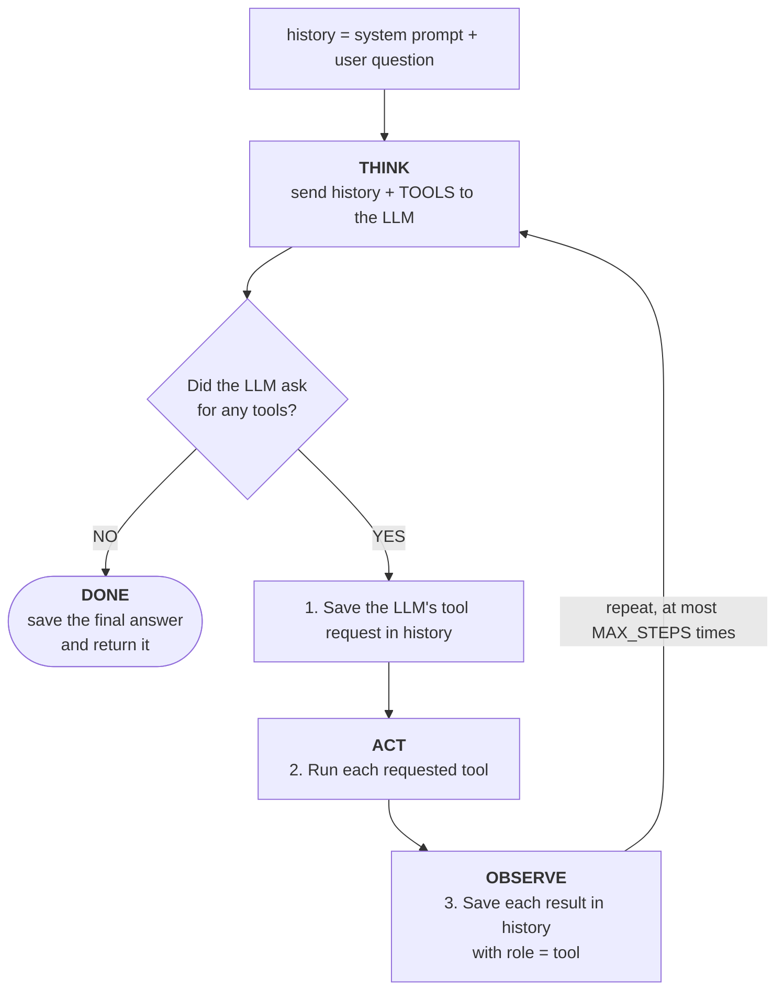

| Line / concept | Ye kyun zaroori hai |
|---|---|
| `role: "system"` | Agent ke instructions: wo kaun hai, kaunse rules follow karne hain. |
| `if not msg.tool_calls` | Koi tool nahi maanga matlab ye final answer hai. |
| `history.append({"role": "assistant", ...})` | Model ko "yaad" rehna chahiye ki usne tool maanga tha. |
| `role: "tool"` with `tool_call_id` | Har result ko usi request se jodta hai jiska wo jawab hai. |
| `MAX_STEPS = 6` | Safety limit, taaki confuse hua model hamesha loop me na rahe. |
| `try / except` around the tool | Fail hua tool program crash karne ki jagah error message model ko wapas bhejta hai. Model dobara try kar sakta hai ya samjha sakta hai. |

### Watch the memory grow

Sawaal *"Temperature difference between Delhi and Mumbai?"* ke liye har round ke baad `history` aisi dikhti hai. **Poori list** har baar LLM ko bheji jaati hai. Isi tarah wo "yaad" rakhta hai.

```text
 Round 1 (sent to LLM)            Round 2 (sent to LLM)            Round 3 (sent to LLM)
 ─────────────────────            ─────────────────────            ─────────────────────
 [system] You are helpful...      [system] You are helpful...      [system] You are helpful...
 [user]   Delhi vs Mumbai?        [user]   Delhi vs Mumbai?        [user]   Delhi vs Mumbai?
                                  [assistant] call get_weather     [assistant] call get_weather
                                              (Delhi), (Mumbai)                (Delhi), (Mumbai)
                                  [tool] Delhi: 33.1°C             [tool] Delhi: 33.1°C
                                  [tool] Mumbai: 28.4°C            [tool] Mumbai: 28.4°C
                                                                   [assistant] call calculator
                                                                               (33.1 - 28.4)
                                                                   [tool] 4.7
        │                                │                                │
        ▼                                ▼                                ▼
 LLM: "call get_weather x2"       LLM: "call calculator"           LLM: "Delhi is 4.7°C warmer"
                                                                        → FINAL ANSWER
```

### Run your agent

```bash
python step3_agent.py
```

Ye prompts ek ek karke try karo aur `[Step ...]` lines dekho:

| Prompt | Aapko kya dikhna chahiye |
|---|---|
| `What is the weather in Delhi?` | Ek tool call (`get_weather`) |
| `What is the temperature difference between Delhi and Mumbai?` | **Multi-step**: `get_weather` do baar, phir `calculator` |
| `What time is it? Save it as a note.` | `get_time`, phir `save_note`. Nayi `notes.txt` file check karo. |
| `Hi, who are you?` | Koi tool call nahi, seedha jawab |
| `Now what about Bangalore?` (weather wale sawaal ke baad) | Memory se samajh jaata hai ki aap weather ki baat kar rahe ho |

Band karne ke liye `exit` likho.

### Map it back to the theory

```mermaid
flowchart LR
  t1["1. LLM"] --> c1["client + MODEL<br/><i>config.py</i>"]
  t2["2. Instructions"] --> c2["SYSTEM_PROMPT<br/><i>step3_agent.py</i>"]
  t3["3. Tools"] --> c3["FUNCTIONS + TOOLS<br/><i>tools.py</i>"]
  t4["4. Memory"] --> c4["history list<br/><i>step3_agent.py</i>"]
  t5["5. Loop"] --> c5["for step in range(...)<br/><i>run_agent()</i>"]
```

**Badhai ho. Aapne ek kaam karta hua AI agent bana liya.** Har agent framework (LangChain, Google ADK, CrewAI, OpenAI Agents SDK) andar yahi loop chalata hai, bas uske aas paas zyada features hote hain.

---

## 17. Step 5: Switch to a Free Cloud Model

Ye tab kaam aata hai jab laptop slow ho, RAM kam ho, ya aap models compare karna chaho. **Agent ka code nahi badalta**; sirf `.env` edit karni hai.

### Option A: Google Gemini (free tier)

1. [aistudio.google.com/apikey](https://aistudio.google.com/apikey) pe jao aur Google account se sign in karo.
2. **Create API key** pe click karo aur key copy karo.
3. `.env` edit karo:
   ```bash
   PROVIDER=gemini
   GEMINI_API_KEY=paste-your-key-here
   ```

### Option B: Groq (free tier, very fast)

> **Groq aur Grok alag hain.** **Groq** (groq.com) ek company hai jo open models ko bahut fast chips pe chalati hai; iski keys `gsk_` se shuru hoti hain. **Grok** xAI ka banaya ek alag AI model hai. Ye guide **Groq** use karti hai.

**1. Free key lo**

1. [console.groq.com/keys](https://console.groq.com/keys) pe jao aur sign up karo (credit card nahi chahiye).
2. **Create API Key** pe click karo, koi bhi naam do, aur key copy karo. Ye `gsk_` se shuru hoti hai.
3. Ise `.env` me paste karo:
   ```bash
   GROQ_API_KEY=gsk_your_key_here
   GROQ_MODEL=openai/gpt-oss-20b
   ```
   `=` ke aas paas space nahi, aur quotes nahi.

**2. Check karo ki aapki key kaunse models use kar sakti hai**

Groq time time pe models jodta aur hatata rehta hai, isliye pehle Groq se poocho ki **aapki** key ke liye kaunse models available hain:

```bash
PROVIDER=groq python -c "from config import client; print('\n'.join(sorted(m.id for m in client.models.list())))"
```

Example output:

```text
[Config] Provider: groq | Model: openai/gpt-oss-20b
allam-2-7b
openai/gpt-oss-120b
openai/gpt-oss-20b
qwen/qwen3.8-27b
whisper-large-v3
...
```

Aisa **chat model chuno jo tool calling support kare**:

| Model | Notes |
|---|---|
| `openai/gpt-oss-20b` | **Recommended.** Fast hai, tool calling me achha hai. Is project ke saath test kiya gaya hai. |
| `openai/gpt-oss-120b` | Bada aur zyada smart, thoda slow |

`whisper-...` (speech-to-text), `...prompt-guard...` ya `...safeguard...` (safety filters) ya `orpheus...` (text-to-speech) mat chunna. Ye chat models nahi hain.

> **`404 model_not_found` aaya?** `GROQ_MODEL` me jo model hai wo aapki list me nahi hai (jaise `llama-3.3-70b-versatile` ab kai accounts pe available nahi hai). `GROQ_MODEL` ko upar wali list ke kisi model se badal do.

**3. Agent ko Groq pe chalao**

Ya to `.env` me provider hamesha ke liye badlo:

```bash
PROVIDER=groq
```

aur chalao:

```bash
python step3_agent.py
```

**ya phir** bina koi file badle **sirf ek run ke liye** switch karo:

```bash
PROVIDER=groq python step3_agent.py
```

Ab pehli line me ye dikhna chahiye:

```text
[Config] Provider: groq | Model: openai/gpt-oss-20b
```

Poocho `What is the temperature difference between Delhi and Mumbai?`. Ollama jaisi hi `[Step ...]` tool calls dikhengi, lekin jawab kaafi jaldi aayega. Same tools, same loop, alag dimaag.

> **Workshop tip:** `PROVIDER=ollama python step3_agent.py` aur phir `PROVIDER=groq python step3_agent.py` ek ke baad ek chalao. Audience dekhegi ki **bilkul same agent code** local model pe bhi chalta hai aur cloud model pe bhi.

### Why `gpt-oss` needed a small code change

`gpt-oss` ek **reasoning model** hai: apne jawab ke saath wo kuch extra fields bhi bhejta hai (jaise apni private reasoning). `step3_agent.py` me hum model ki tool request ko poora jawab copy karne ki jagah sirf teen fields ke saath `history` me save karte hain: `role`, `content` aur `tool_calls`. Isse request **har** provider (Ollama, Gemini aur Groq) ke liye valid rehti hai.

### Local vs cloud at a glance

| | Ollama (local) | Gemini / Groq (cloud) |
|---|---|---|
| Cost | Free | Free tier (limits ke saath) |
| Internet chahiye | Sirf weather jaise tools ke liye | Haan |
| API key | Nahi | Haan |
| Privacy | Data aapke laptop pe hi rehta hai | Data provider ke paas jaata hai |
| Speed | Aapke laptop pe depend karta hai | Aam taur pe fast (Groq bahut fast hai) |

> Free tiers ki rate limits hoti hain (per minute aur per day requests). `429` error aaye to ek minute ruko ya provider badlo. Model ke naam time ke saath badalte hain; agar model na mile, to models ki list dobara nikalo aur `.env` me `GEMINI_MODEL` ya `GROQ_MODEL` update karo.

Local model pe wapas jaane ke liye `PROVIDER=ollama` set karo.

---

## 18. Exercise: Add Your Own Tool

Naya tool jodne me hamesha wahi **teen steps** lagte hain, sab `tools.py` me:

```mermaid
flowchart LR
  A["1. Write the function<br/>it does the work"] --> B["2. Add it to FUNCTIONS<br/>name → function"] --> C["3. Describe it in TOOLS<br/>so the LLM knows it exists"]
```

Example: ek tool jo Indian Rupees ko US Dollars me badalta hai.

**1. Function likho**

```python
def inr_to_usd(amount: float) -> str:
    rate = 0.012   # fixed demo rate
    return f"{amount} INR = {round(amount * rate, 2)} USD"
```

**2. Ise `FUNCTIONS` me register karo**

```python
FUNCTIONS = {
    "get_weather": get_weather,
    "calculator": calculator,
    "get_time": get_time,
    "save_note": save_note,
    "inr_to_usd": inr_to_usd,      # new
}
```

**3. Ise `TOOLS` me describe karo** (ye item list me jodo)

```python
    {
        "type": "function",
        "function": {
            "name": "inr_to_usd",
            "description": "Converts an amount in Indian Rupees (INR) to US Dollars (USD)",
            "parameters": {
                "type": "object",
                "properties": {"amount": {"type": "number", "description": "Amount in INR"}},
                "required": ["amount"],
            },
        },
    },
```

Agent restart karo aur poocho: `How many dollars is 5000 rupees?`

**Aur ideas:** random joke wala tool, to-do list (file me tasks jodna aur dikhana), `notes.txt` padhne wala "read my notes" tool, word counter, ya Wikipedia summary lookup.

---
---

# PART 3: GO DEEPER

Aapne ek single agent bana liya. Ye part un badi ideas ko simple shabdon me samjhata hai jinke baare me aap sunoge.

---

## 19. Memory: Short-Term and Long-Term

Memory se agent ko yaad rehta hai ki pehle kya ho chuka hai.

```mermaid
flowchart LR
  S["<b>SHORT-TERM MEMORY</b><br/><br/>The current conversation (our history list)<br/>Sent to the LLM on every call<br/>Lost when the program stops<br/><br/><i>Like: what you remember from this meeting</i>"]
  L["<b>LONG-TERM MEMORY</b><br/><br/>Saved outside the conversation<br/>(file, database, vector DB)<br/>Looked up only when needed<br/>Survives restarts<br/><br/><i>Like: your diary or contact list</i>"]
  S ~~~ L
```

**Problem:** LLMs ki ek **context window** hoti hai, yaani ek baar me zyada se zyada kitna text padh sakte hain. Lambi chat me `history` itni badh jaati hai ki fit hi nahi hoti.

**Common fixes:**
- **Trim:** sirf aakhri N messages rakho.
- **Summarize:** purane messages ki jagah ek chhota summary rakho.
- **Retrieve:** facts long-term memory me rakho aur sirf zaroori wale nikaalo.

> **Try karo:** program band hote waqt `history` ko ek JSON file me save karo aur start pe load karo. Ab aapka agent har run ke beech yaad rakhega.

---

## 20. Types of AI Agents

Saare agents loop use karte hain, lekin apni soch ko alag alag tarike se organize karte hain. Ye sabse common patterns hain.

### 20.1 ReAct Agent (Reason + Act): the most common

Ek step sochta hai, action leta hai, result dekhta hai, phir sochta hai. **Aapne yahi banaya hai.**

```text
 Thought:     I need the weather in Delhi.
 Action:      get_weather(city="Delhi")
 Observation: 33.1°C
 Thought:     Now I need Mumbai.
 Action:      get_weather(city="Mumbai")
 Observation: 28.4°C
 Thought:     Now subtract.
 Action:      calculator("33.1 - 28.4")
 Observation: 4.7
 Thought:     I have everything.
 Answer:      Delhi is 4.7°C warmer.
```

**Kiske liye best:** zyada tar roz ke kaam.

### 20.2 Plan-and-Execute Agent

Pehle **poora plan banata hai**, phir ek ek step karta hai.

```mermaid
flowchart LR
  G(["Goal"]) --> P["PLANNER"] --> PL["Plan:<br/>Step 1: search flights<br/>Step 2: check calendar<br/>Step 3: pick the best flight<br/>Step 4: book it"] --> E["EXECUTOR<br/>runs steps 1 to 4"] --> R(["Result"])
  E -. "re-plan if needed" .-> P
```

**Kiske liye best:** lambe, complex kaam jahan clear plan madad karta hai.

### 20.3 Reflection Agent

Draft likhta hai, **apne kaam ki khud galtiyan nikaalta hai**, phir use behtar karta hai.

```mermaid
flowchart LR
  G(["Goal"]) --> W["Write draft"] --> R["Review:<br/>what is wrong?"] --> I["Improve"] --> Q{"Good enough?"}
  Q -- "No, repeat" --> R
  Q -- Yes --> F(["Final"])
```

**Kiske liye best:** writing, code, aur jahan speed se zyada quality zaroori ho.

### 20.4 Agentic RAG

**RAG** ka matlab **Retrieval-Augmented Generation**: jawab dene se pehle relevant documents dhoondho aur LLM ko do. **Agentic** RAG me agent **khud decide karta hai** ki search karna hai ya nahi, kya search karna hai, aur dobara search karna hai ya nahi.

```mermaid
flowchart TD
  Q(["Question"]) --> A{"Agent: do I need to<br/>look something up?"}
  A -- NO --> D(["Answer directly"])
  A -- YES --> S["Search documents"] --> E{"Is this enough?"}
  E -- "NO: search again<br/>with a better query" --> S
  E -- YES --> F(["Answer using the documents"])
```

**Kiske liye best:** apni PDFs se chat, company ka knowledge base, support docs.

### 20.5 Multi-Agent System

Kai agents, har ek ka **ek kaam**, ek team ki tarah saath kaam karte hain. Agla section dekho.

| Type | Ek line me idea | Speed | Quality |
|---|---|---|---|
| ReAct | Socho, karo, repeat | Fast | Achhi |
| Plan-and-Execute | Pehle plan, phir kaam | Medium | Lambe kaam ke liye achhi |
| Reflection | Draft, review, improve | Slow | High |
| Agentic RAG | Zarurat pe apna data search karo | Medium | Knowledge wale sawaalon ke liye high |
| Multi-Agent | Specialists ki team | Zyada slow | Bade kaam ke liye high |

---

## 21. Multi-Agent Systems

Ek agent sab kuch kare to confuse ho jaata hai, bilkul waise hi jaise company me ek insaan har kaam kare. Isliye hum kaam ko **specialist agents** me baant dete hain.

**Example: trip planner**

```mermaid
flowchart TD
  U(["Plan a 3-day Goa trip"]) --> M["<b>MANAGER AGENT</b><br/>(orchestrator)"]
  M <--> F["<b>FLIGHT AGENT</b><br/>tool: search flights"]
  M <--> H["<b>HOTEL AGENT</b><br/>tool: search hotels"]
  M <--> A["<b>ACTIVITIES AGENT</b><br/>tools: maps, reviews"]
  M --> R(["Final trip plan"])
```

**Kai agents kyun?**
- Har agent ka **chhota, focused prompt** hota hai aur sirf zaroori tools, isliye galtiyan kam hoti hain.
- Agents **parallel** me kaam kar sakte hain, jo tez hai.
- Ek agent dusre agent ka kaam **check** kar sakta hai.

**Rule of thumb:** har agent ko **ek clear kaam** do.

---

## 22. How Agents Talk to Each Other

Multi-agent system me agents ko ek dusre ko messages bhejne padte hain. **Message** aam taur pe kuch standard fields wala JSON hota hai:

```json
{
  "from": "research_agent",
  "to": "writer_agent",
  "type": "result",
  "content": "Top 3 beaches in Goa: Palolem, Baga, Anjuna",
  "context": { "task_id": "trip-42", "step": 2 }
}
```

Agents ko jodne ke **chaar common tarike** hain.

### 22.1 Direct (one-to-one)

```mermaid
flowchart LR
  A["Agent A"] <--> B["Agent B"]
```

Agents seedha ek dusre ko message karte hain, phone call ki tarah.
- **Achha:** simple, fast.
- **Bura:** agents zyada hon to connections ka jaal ban jaata hai.

### 22.2 Centralized (manager in the middle)

```mermaid
flowchart TD
  M["MANAGER"]
  A["Agent A"] <--> M
  B["Agent B"] <--> M
  C["Agent C"] <--> M
  D["Agent D"] <--> M
```

Sab sirf manager se baat karte hain, team lead ki tarah.
- **Achha:** control karna, monitor karna aur naye agents jodna aasaan.
- **Bura:** manager bottleneck ban sakta hai.

### 22.3 Broadcast (one-to-many, publish/subscribe)

```mermaid
flowchart LR
  A["Agent A<br/>New order no. 55"] --> B["Agent B<br/>interested: acts"]
  A --> C["Agent C<br/>not interested: ignores"]
  A --> D["Agent D<br/>interested: acts"]
```

Ek agent kuch announce karta hai; jis agent ko matlab hai wo react karta hai, group announcement ki tarah.
- **Achha:** flexible, naye listeners jodna aasaan.
- **Bura:** track karna mushkil ki kisne kya kiya.

### 22.4 Shared Memory (blackboard)

```mermaid
flowchart LR
  A["Agent A"] -- write --> BB[("SHARED BLACKBOARD<br/>common memory / database")]
  D["Agent D"] -- write --> BB
  BB -- read --> B["Agent B"]
  BB -- read --> C["Agent C"]
```

Agents ek dusre ko kabhi message nahi karte. Wo ek common jagah pe padhte aur likhte hain, office ke shared whiteboard ki tarah.
- **Achha:** sabko same state dikhti hai.
- **Bura:** do agents ek saath likhein to takraav ho sakta hai.

| Pattern | Real-life example | Kab use karein |
|---|---|---|
| Direct | Phone call | 2 ya 3 agents, simple flow |
| Centralized | Team lead kaam baant raha hai | Jab control aur visibility chahiye |
| Broadcast | WhatsApp group announcement | Jab kai agents events pe react kar sakte hain |
| Shared Memory | Office whiteboard | Jab agents ek dusre ke kaam pe aage badhte hain |

Real systems aksar inhe **mix** karte hain. Jaise, manager flow control karta hai aur worker agents ek common memory share karte hain.

---

## 23. MCP and A2A: The Standard Protocols

**Protocol** baat karne ke liye tay kiye gaye rules ka set hai, jaise sab ek hi shape ka plug use karne pe sahmat hon. Do open protocols agents ke liye standard ban rahe hain.

### 23.1 MCP (Model Context Protocol): agent ↔ tools

**Problem:** Har app (GitHub, Slack, Google Drive, database) ki API alag hoti hai. Har ek ke liye custom tool code likhna slow hai.

**Solution:** MCP agent ko tools aur data se jodne ka ek standard tarika hai. Tool provider **ek MCP server** banata hai, aur **koi bhi** MCP-compatible agent use use kar sakta hai.

```mermaid
flowchart LR
  subgraph WO["❌ WITHOUT MCP: new code for every tool"]
    direction LR
    A1["Agent"] -- custom code --> G1["GitHub"]
    A1 -- custom code --> S1["Slack"]
    A1 -- custom code --> D1["Database"]
  end
  subgraph WI["✅ WITH MCP: one standard, plug and play"]
    direction LR
    A2["Agent"] --> M["MCP"]
    M --> G2["GitHub server"]
    M --> S2["Slack server"]
    M --> D2["Database server"]
  end
  WO ~~~ WI
```

MCP ko **AI tools ka USB-C port** samjho.

### 23.2 A2A (Agent2Agent Protocol): agent ↔ agent

**Problem:** Alag companies ya frameworks ke bane agents ek dusre ko samajh nahi paate.

**Solution:** A2A ek standard tarika hai jisse agents ek dusre ko dhoondh sakein, tasks share kar sakein aur results bhej sakein, alag companies ke beech bhi.

```mermaid
sequenceDiagram
  participant Y as Your travel agent (built with ADK)
  participant A as Airline booking agent (another company)
  Y->>A: A2A: "Book seat 12A"
  A-->>Y: A2A: "Confirmed, PNR X"
```

### 23.3 How they fit together

```mermaid
flowchart TB
  A1["Agent 1"] <-->|"A2A: agent ↔ agent"| A2["Agent 2"]
  A1 -->|"MCP: agent ↔ tools"| T1["Tools and data"]
  A2 -->|"MCP: agent ↔ tools"| T2["Tools and data"]
```

| | MCP | A2A |
|---|---|---|
| Kisko jodta hai | Agent ko **tools aur data** se | Agent ko **dusre agents** se |
| Analogy | USB-C port | Ek common business language |
| Example | Agent aapke GitHub issues padhta hai | Aapka agent airline ke agent se seat book karwata hai |

Dono open standards hain aur ek dusre ke khilaaf nahi, **saath** kaam karte hain. Agents ke baat karne ke aur tarike bhi hain, jaise simple **HTTP/REST APIs** aur **message queues** (jaise Kafka ya RabbitMQ), jinse bheje gaye messages baad me process hote hain.

---

## 24. What Goes Wrong (and How to Fix It)

"Happy path" banana aasaan hai. Agent ka asli kaam zyada tar ye sambhalna hai ki kya galat ho sakta hai.

| Problem | Kya hota hai | Fix |
|---|---|---|
| **Infinite loop** | Agent baar baar same tool call karta rehta hai | **Max steps** limit lagao (hum `MAX_STEPS` use karte hain) |
| **Wrong tool** | Weather ke sawaal pe agent calculator chun leta hai | **Clear, specific tool descriptions** likho |
| **Made-up tools or inputs** | Agent aisa tool call karta hai jo hai hi nahi, ya galat inputs deta hai | Call ko **validate** karo aur error wapas bhejo taaki wo dobara try kare (hamara `try/except`) |
| **Context overflow** | History model ke liye bahut lambi ho jaati hai | Purane messages **trim ya summarize** karo |
| **Stops too early** | Agent kaam poora hone se pehle jawab de deta hai | System prompt me clearly likho ki **kaam kab poora hota hai** |
| **Unsafe actions** | Agent galti se email bhej deta hai ya paise de deta hai | Risky actions ke liye **insaan se approval** lo |
| **Bad information spreads** (multi-agent) | Ek agent ki galti baaki agents use kar lete hain | Ek **reviewer** agent jodo; messages validate karo |
| **Agents talking forever** (multi-agent) | Do agents ek dusre ko reply karte hi rehte hain | Har task me **messages ki sankhya** limit karo |

**Best practices:**
- Har agent ko **ek clear kaam** do.
- Tools **chhote aur focused** rakho, achhe descriptions ke saath.
- Har step **log** karo (hamare `[Step ...]` prints ki tarah), taaki dikhe ki agent ne kya kiya.
- **Gracefully fail karo:** crash hone ki jagah model ko error message wapas do.
- Paise, messages ya data delete karne wale kisi bhi kaam ke liye **insaan ka approval** zaroori rakho.

---

## 25. When to Use an Agent (and When Not To)

Agents powerful hain lekin normal code se zyada slow, mehenge aur kam predictable hain.

```mermaid
flowchart TD
  Q1{"Does the task need<br/>multiple steps?"}
  Q1 -- NO --> R1["A single LLM call is enough"]
  Q1 -- YES --> Q2{"Are the steps<br/>always the same?"}
  Q2 -- YES --> R2["Normal code / fixed pipeline<br/>no agent needed"]
  Q2 -- NO --> Q3{"Does the next step depend<br/>on the previous result?"}
  Q3 -- YES --> R3(["USE AN AGENT"])
  Q3 -- NO --> R2
```

| Agent use karo jab... | Agent use MAT karo jab... |
|---|---|
| Kaam me kai steps hon | Ek LLM call se hi kaam ho jaye |
| Agla step pichhle results pe depend kare | Steps hamesha same hon |
| Live data ya asli actions chahiye | Speed aur cost sabse zyada matter kare |
| Raasta flexible ho | Har baar bilkul same output chahiye |

---

## 26. Real AI Agents You Already Know

| Type | Examples | Ye kya karte hain |
|---|---|---|
| Coding agents | Claude Code, Cursor, GitHub Copilot | Aapka code padhte hain, files edit karte hain, tests chalate hain, errors theek karte hain |
| Research agents | Deep Research, Perplexity | Kai sources search karke report likhte hain |
| Browser agents | Computer-use agents | Websites pe click, type aur forms fill karte hain |
| Support agents | Customer support bots | Orders dekhte hain, sawaalon ke jawab dete hain, tickets banate hain |
| Data agents | Data analysis assistants | Databases query karte hain, charts banate hain, results samjhate hain |
| Personal assistants | Calendar / email assistants | Meetings schedule karte hain, replies draft karte hain |

Ye sab wahi idea use karte hain jo aapne aaj banaya: **LLM + tools + memory + loop**.

---

## 27. Troubleshooting

| Problem | Fix |
|---|---|
| `command not found: ollama` | Ollama install nahi hai ya PATH me nahi hai. [ollama.com/download](https://ollama.com/download) se dobara install karo aur naya terminal kholo. |
| `ollama` likhne pe menu aata hai (Claude Code, OpenCode...) | `Esc` dabao. Poori command likho, jaise `ollama pull qwen2.5:7b`. |
| `Connection refused` / `APIConnectionError` | Ollama server nahi chal raha. Ollama app kholo (macOS/Windows) ya `ollama serve` chalao (Linux). |
| Groq `404 model_not_found` (jaise `llama-3.3-70b-versatile`) | Groq time ke saath models badalta hai. `PROVIDER=groq python -c "from config import client; print('\n'.join(sorted(m.id for m in client.models.list())))"` se apni key ke models dekho aur `.env` me `GROQ_MODEL` ko unme se kisi ek pe set karo (jaise `openai/gpt-oss-20b`). |
| `model "qwen2.5:7b" not found` | `ollama pull qwen2.5:7b` chalao, ya `.env` me `OLLAMA_MODEL` ko `ollama list` me dikhne wale model pe set karo. |
| `ModuleNotFoundError: No module named 'openai'` | venv active nahi hai. `source venv/bin/activate` (ya Windows wala version) chalao, phir `pip install -r requirements.txt`. |
| `GEMINI_API_KEY is missing` / `GROQ_API_KEY is missing` | `.env` me key khaali hai, ya `.env` us folder me nahi hai jahan se script chalayi. |
| Error `429` | Free-tier rate limit. Ek minute ruko ya `PROVIDER` badlo. |
| Error `401` / `403` | API key galat hai ya usme extra spaces hain. Nayi key banao. |
| Agent bina tool use kiye jawab deta hai | Chhote models kabhi kabhi tools skip kar dete hain. `qwen2.5:7b` ya bada model use karo, sawaal zyada specific poocho, ya tool ka `description` behtar karo. |
| Weather me `(offline sample data)` dikhta hai | Internet band hai ya block hai. Demo phir bhi chalega; live data ke liye internet connect karo. |
| Jawab bahut slow aate hain | Bhaari apps band karo, chhota model (`qwen2.5:3b`) use karo, ya Groq pe switch karo. |
| macOS pe `zsh compinit: insecure directories` warning | Is project se related nahi hai. Ek baar `compaudit \| xargs chmod g-w` chala ke theek karo. |

---

## 28. Glossary

| Term | Simple matlab |
|---|---|
| **LLM** | Large Language Model. Ek AI jo text padhta hai aur text likhta hai. |
| **AI Agent** | Ek LLM jo steps decide kar sakta hai, tools use kar sakta hai aur goal poora hone tak loop me kaam karta hai. |
| **Prompt** | Jo text aap LLM ko bhejte ho. |
| **System prompt** | Hidden instructions jo agent ka role aur rules tay karte hain. |
| **Tool / Function calling** | LLM ka aapke code se kehna ki kuch inputs ke saath ek function chalao. |
| **JSON Schema** | Ek standard format jisse batate hain ki tool ko kaunse inputs chahiye. |
| **Agent loop** | Think → Act → Observe → repeat, jab tak goal poora na ho. |
| **Observation** | Tool ka result, jo wapas LLM ko diya jaata hai. |
| **Memory / history** | Jo hua uska record, jo har baar LLM ko bheja jaata hai. |
| **Context window** | Ek baar me LLM zyada se zyada kitna text padh sakta hai. |
| **Token** | Text ka chhota tukda (lagbhag ¾ shabd). LLM ki limits aur keemat tokens me gini jaati hai. |
| **Parameters (7b, 14b)** | Model ka size, billions me. Bada aam taur pe zyada smart lekin slow. |
| **Ollama** | Apne computer pe LLMs chalane ki free app. |
| **OpenAI-compatible API** | Ek common request format jo kai providers (Ollama, Gemini, Groq) accept karte hain. |
| **RAG** | Retrieval-Augmented Generation. Pehle documents dhoondho, phir jawab do. |
| **ReAct** | Reason + Act. Think-act-observe wala agent pattern. |
| **Multi-agent system** | Kai specialist agents jo saath kaam karte hain. |
| **Orchestrator** | Manager agent jo baaki agents ko kaam baantta hai. |
| **MCP** | Model Context Protocol. Agents ko tools aur data se jodne ka standard. |
| **A2A** | Agent2Agent Protocol. Agents ke aapas me baat karne ka standard. |
| **Rate limit** | Free (ya paid) API per minute ya per day zyada se zyada kitni requests allow karti hai. |

---

## 29. What Next?

Ab aap **har** AI agent framework ka core samajh gaye ho.

```mermaid
flowchart TD
  S1["1. Single agent from scratch<br/><b>you are here</b>"] --> S2["2. Add long-term memory<br/>save history to a file / database"]
  S2 --> S3["3. Add real tools<br/>news, calendar, database, web search"]
  S3 --> S4["4. Add a UI<br/>Streamlit or Gradio"]
  S4 --> S5["5. Try a framework<br/>LangChain, Google ADK, CrewAI, OpenAI Agents SDK"]
  S5 --> S6["6. Build a multi-agent system<br/>and connect tools with MCP"]
```

Ideas:
- **Behtar memory:** `history` ko JSON file me save karo taaki agent har run ke beech yaad rakhe.
- **Asli APIs as tools:** news, stock prices, aapka calendar, database.
- **UI:** `run_agent()` ko [Streamlit](https://streamlit.io) ya [Gradio](https://gradio.app) ke saath ek chhoti web app me daalo.
- **Guardrails:** koi tool risky kaam kare usse pehle user se confirm karwao.
- **Frameworks:** yahi project LangChain ya Google ADK me dobara banao aur dekho framework kitna code bachata hai.

---

### Quick Reference

```bash
# one-time setup
ollama pull qwen2.5:7b
python3 -m venv venv
source venv/bin/activate          # Windows: venv\Scripts\activate
pip install -r requirements.txt
cp .env.example .env              # Windows: copy .env.example .env

# run the steps
python step1_chat.py              # plain LLM
python step2_tools.py             # model asks for a tool
python step3_agent.py             # full AI agent
```

### Further Reading

- [Ollama](https://ollama.com)
- [Model Context Protocol](https://modelcontextprotocol.io)

Happy building!

---

## About the Author

**Anand Gaur**

Meri **books**, **services** aur baaki resources ki details ke liye meri website dekho: **[anandgaur.com](https://anandgaur.com)**

### 🔗 Follow, Subscribe and Connect with Me

| | Platform | Link |
|---|---|---|
| 🌐 | **Website** | [anandgaur.com](https://anandgaur.com) |
| 💼 | **LinkedIn** | [linkedin.com/in/anandgaur22](https://www.linkedin.com/in/anandgaur22) |
| 📖 | **Medium** | [medium.com/@anandgaur2207](https://medium.com/@anandgaur2207) |
| 📸 | **Instagram** | [instagram.com/tech.anandgaur](https://www.instagram.com/tech.anandgaur) |
| ▶️ | **YouTube** | [youtube.com/@technicalanandgaur](https://www.youtube.com/@technicalanandgaur) |
| 💻 | **GitHub** | [github.com/anandgaur22](https://github.com/anandgaur22) |

Agar ye guide aapke kaam aayi, to kisi aise dost ke saath share karo jo AI agents seekhna chahta hai.
